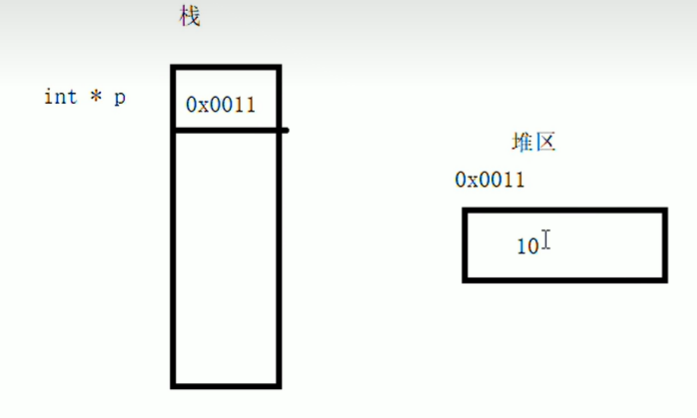

# 内存分区模型

1. **代码区**   存放函数的二进制代码（编辑的所有代码），由操作系统管理
2. **全局区**   存放==全局，静态变量和常量（除了局部常量）==
3. **栈区**       由编译器自动分配释放，存放函数的参数值，==局部==变量，==局部==常量等
4. **堆区**       由程序员分配和释放，若程序员不释放，程序结束时由操作系统回收

### 程序运行前

程序编译后生成.exe可执行程序，**未执行程序前**分为两个区域

**代码区：**

​	存放CPU执行的机器指令

​	代码区是**共享**的，共享的目的是对于频繁被执行的程序，只需要在内存中有一份代码即可

​	代码区是**只读**的，防止误操作

**全局区：**

​	==该区域的数据在程序结束后由操作系统释放==

**静态变量**

`static int a = 10;`

**在普通变量前加 static 就是静态变量**

### 程序运行后

注意：**不要返回局部变量地址**，**栈区**开辟的数据由编译器**自动释放**，除非加 ==static== 关键字

### 堆区

C++中主要利用 ==new== 在堆区中开辟内存

利用 **new** 关键字，可以将数据**开辟到堆区**

指针本质也是局部变量，放在栈上，指针保存的数据是放在堆区

```c++
int *p = new int(10);
return p;
```

**返回new出来内存的地址**

