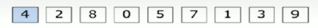
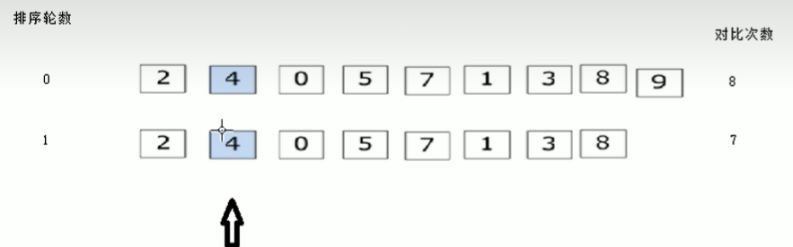

# 冒泡排序



1. 比较相邻的元素，如果第一个比第二个大，就交换他们两个
2. 对每一对相邻元素做同样的工作，执行完毕后，找到第一个最大值
3. 重复步骤，每次比较次数-1，直到结束

第一次：对比次数 8（共有8个相邻），找到第一个最大值

第二次：对比次数7 （共有7个相邻），找到第二个最大值



```c
#include <stdio.h>
int main()
{   
    int arr1[9] = {4, 2, 8, 0, 5, 7, 1, 3, 9};
    int num = sizeof(arr1) / 4 - 1;
    while(num > 1){
        for(int i = 0; i < num; i++){
            if(arr1[i] > arr1[i + 1]){
                int temp = arr1[i];
                arr1[i] = arr1[i + 1];
                arr1[i + 1] = temp;
            }
        }
        num--; 
    }
    for(int i = 0; i < 9; i++)
            printf("%d", arr1[i]);
}
```

