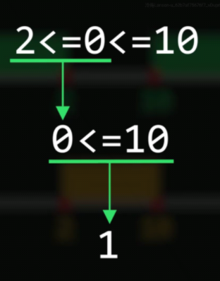
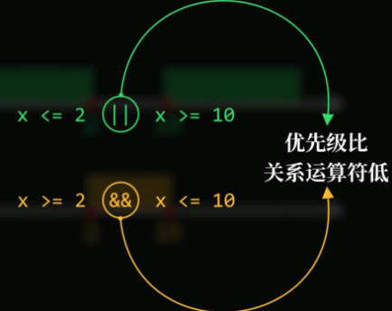
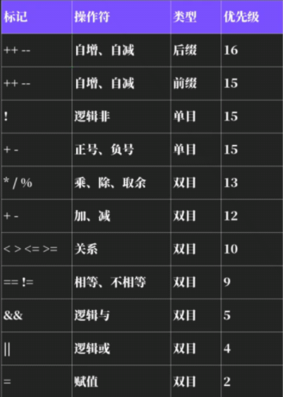

## 关系和逻辑运算符

#### 真与假

==0表示假，1表示真==

#### 等于与不等于

等于 ==        不等于 ！==

#### 与人类认知冲突的地方

2<=0<=10  在人类认知中为false，但在计算机世界里为true

计算机只能一步一步走，先判断前半段，然后返回false 0，再接着判断0与10关系，返回true 1

由此，我们引入逻辑运算符  与或非运算符

#### 逻辑运算符（与或非）

与：==&&==       或：==||==        非：==！==

(x <= 2) || (x >= 10)         (x >= 2) && (x <= 10)        括号可以不加

C语言中，==非0数为真==，**6为真，!6为假**

