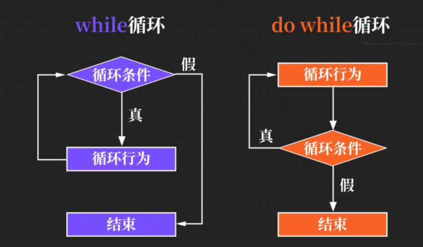
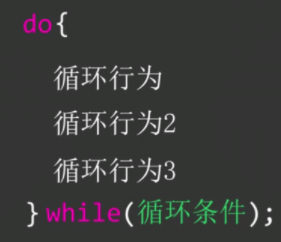
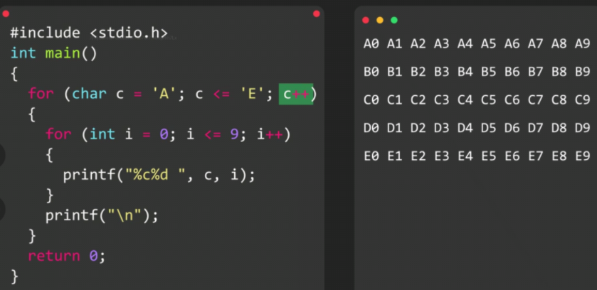

## 循环

#### while循环

while（循环条件）循环行为{}

#### for循环（语法同js）

for循环第一个参数和js中一样，都==只执行一次==

#### for循环和while循环的选则

for一般用于已知循环次数的循环，多搭配计数器使用

while一般用于事先不知道循环总次数的场景，以达到某个目标为目的

**while和for后面不加分号，直接加{}**

#### while与do while的区别

while ==先判断==，后执行循环行为

do while ==先执行一次循环行为==，再进行判断

#### 语法：

do后可加{}，此处while需用==分号;==结尾

#### 循环嵌套

