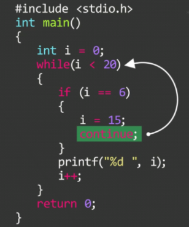
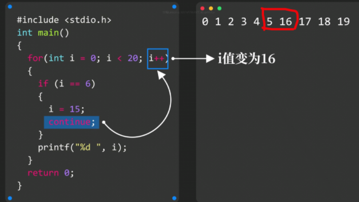

# 循环辅助

### break（适用于while和for循环）

```c
int i = 0;
while(1)
{
    if (i == 10)
        break;
    printf("%d", i);
    i++;
}
```

```c
int password;
    while(1)
    {
        scanf("%d", &password);
        if (password == 12345){
            break;
        }
        printf("back");
    }
    printf("right");
```

**特别注意，break后的代码全部==不执行==，所以要想跳出循环执行代码，需==写在while同级==**

### continue

跳过本次循环，直接开始下一次循环




### for循环用continue的区别



**for中使用break将直接跳出循环，不再更新计数器`i++`**