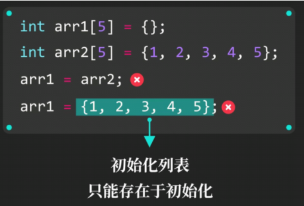
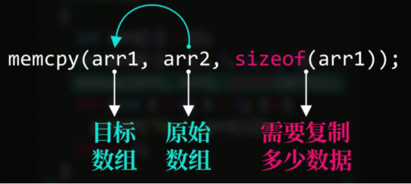
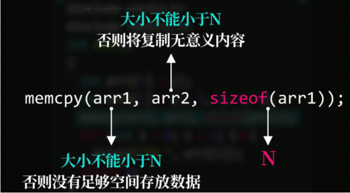

# 数组

**数组内元素类型需相同**

### 声明数组

**语法：元素类型 数组名[元素数量]**

```c
char c[5];
int n[10];
long l[3];
```

### 数组初始化


```c
int arr[6] = {1, 2, 3, 4, 5, 6};
```

​									    ↑初始化列表

若初始化列表长度短于数组长度，剩下元素将==以0填充==

若初始化列表长度长于数组长度，将**报错**

若未知数组长度，则[]中的元素数量可以不写，如

```c
int arr[] = {1, 2, 3, 4, 5, 6, 7};
```

### 访问数组元素

**数组名[下标]**

```c
int arr[] = {1, 2, 3, 4, 5};
printf("%d", arr[0]);//output:1
arr[3] = 100;//arr:1, 2, 3, 100, 5
```

### 数组所占空间大小

数组所占空间大小=单个元素所占空间大小*数组元素个数

### 数组整体赋值



**此举不可行**    ==数组赋值时不可使用初始化列表==

法一：使用循环单个为元素赋值

```c
int arr1[] = {};
int arr2[] = {1, 2, 3, 4, 5};
for(int i = 0; i < 5, i++)
{
    arr1[i] = arr2[i];
}
```

法二：**内存复制**


### `memcpy`函数用法



需在头文件中加入**`memory.h`**

```c
#include <memory.h>
```

```c
#include <stdio.h>
#include <memory.h>
int main()
{
    int arr1[] = {};
    int arr2[] = {1, 2, 3, 4, 5};
    memcpy(arr1, arr2, sizeof(arr1));//arr1:1, 2, 3, 4, 5
}
```


#### 注意事项



**假设需复制的数组长度为N**
