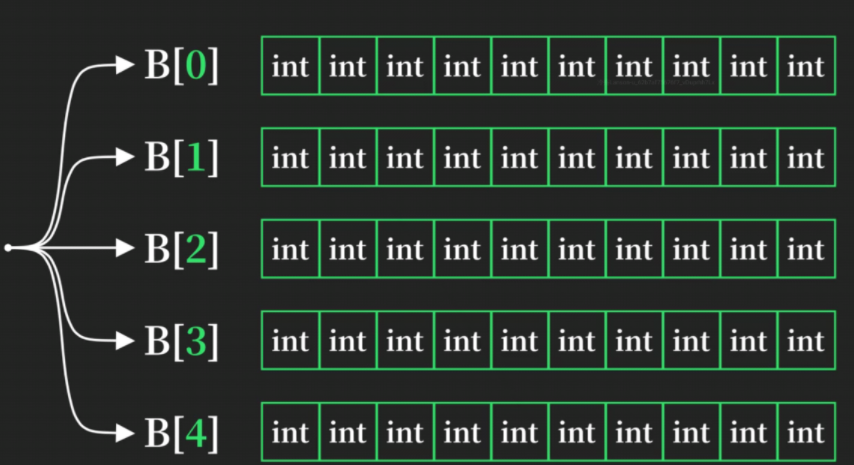
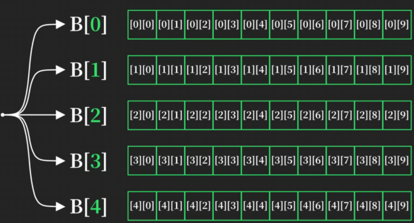

# 多维数组

### 数组作为数组元素即为多维数组

```c
int B[5][10]
```

**元素类型   数组名  数组数量（父级）  每个数组下还有多少个数组（子级）**

**元素类型   数组名  行数  列数**



### 二维数组



### 使用嵌套循环遍历二维数组

```c
#include <stdio.h>
int main()
{
    int arr1[4][7] = {1, 2, 3, 4, 5, 6, 7, 8, 9, 10, 11, 12, 13, 14, 15, 16, 17, 18, 19, 20, 21, 22, 23, 24, 25, 26, 27, 28};
    for(int i = 0; i < 4; i++)
    {
        for(int j = 0; j < 7; j++){
            printf("%d\n", arr1[i][j]);
        }
    }
}
```

