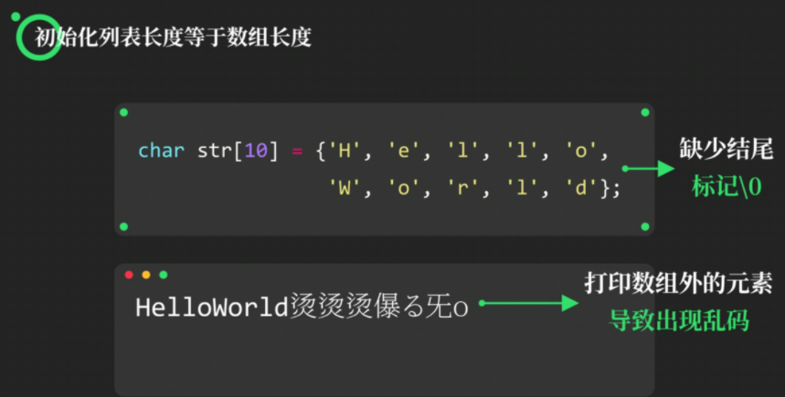

# 字符数组

#### 初始化字符数组

**一定要用==char==进行声明！！！**

C语言不支持不定长数组，故==必须初始化数组长度==

写法错误↓

```c
char str[];   //X！
```


```c
char str[20] = {'H','e','l','l','o','W','o','r','l','d'};
char str[20] = "HelloWorld";//结尾还有个\0
char str[] = {'H','e','l','l','o','W','o','r','l','d'};
```


**三种写法均可**


### 初始化列表等于数组长度



### 字符串数组长度

`sizeof`无法准确测量

法一：使用循环测量字符串长度

```c
char str[20] = "HelloWorld";
int length = 0;
while(str[length] != '\0');
length++;
printf("%d", length);
```

法二：**使用`strlen`函数**测量字符串长度

需在头文件中引入`string.h`

```c
#include <stdio.h>
#include <string.h>
int main()
{
    char str[20] = "HelloWorld";
    int len1, len2;
    len1 = strlen(str);
    len2 = strlen("HelloWorld");
    printf("%d %d", len1, len2);
}
```

**`strlen(str)`测量从第一个元素直到\0的字符串长度**

### 获取输入的字符串数组

```c
char str[20];
scanf("%s", str);
```

特别注意，此处为==字符数组==，故==不加&==

**`scanf`函数会自动在输入时的字符串末尾加上\0**

### `putchar`与`getchar`函数


