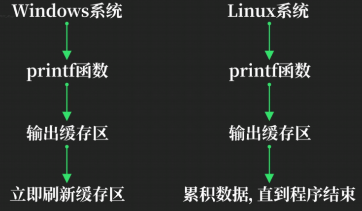
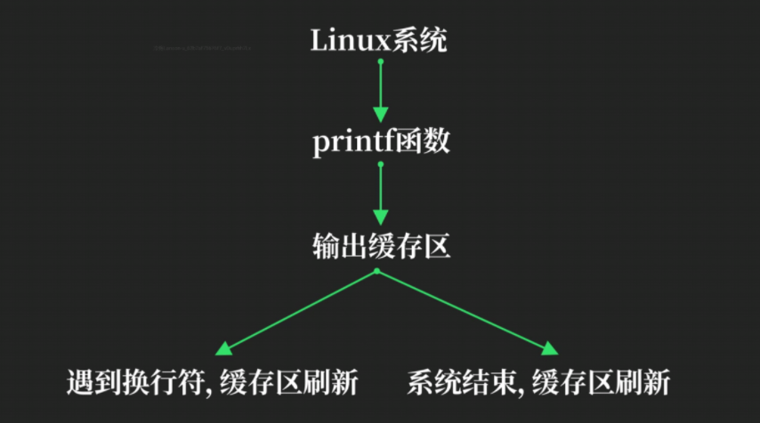
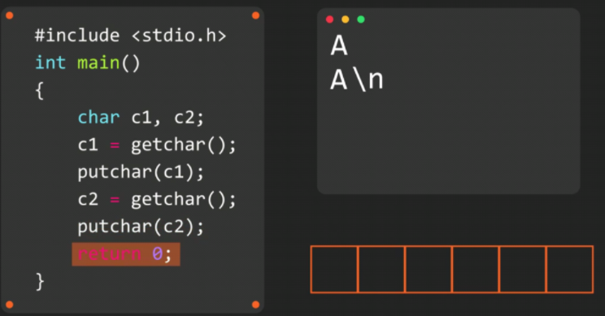
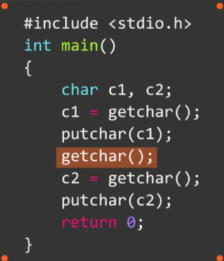

# 输入输出缓存

### Sleep函数

**需在头文件中加入`windows.h`**

```c
#include <stdio.h>
#include <windows.h>
int main()
{
    for (int i = 0; i < 10; i++)
    {
        printf("HelloWorld %d", i);
        Sleep(500);
    }
} //此为windows系统
```

```c
#include <stdio.h>
#include <unistd.h>
int main()
{
    for (int i = 0; i < 10; i++)
    {
        printf("HelloWorld %d", i);
        usleep(1000 * 500); //usleep单位为微秒
    }
} //此为Linux系统
```

差别：windows系统下打印1次停止500毫秒，Linux系统下一次性停止完10个500毫秒后一次性打印

解决办法：在`printf("HelloWorld %d")`的%d后加入\n  =>  `printf("HelloWorld %d\n")`**(行缓存)**

### 输出缓存区



**行缓存**：一行结束之后（\n）必须刷新缓存（Linux）

**完全缓存**：等到缓存区被填满才会刷新缓存

==输出缓存是系统特性，不是函数特性==



### 输入缓存区

输入函数属于**阻塞函数**



第一个`getchar`之后A\n进入输入缓存区，第一个`putchar`输出A，此时暂存区内剩余\n，第二个`getchar`运行时暂存区有数据，不需等待用户输入，阻塞失效，直接输出第二个`putchar` \n

**解决办法：**



再加一个`getchar`吸收缓存区数据

`getchar/putchar`：输入/出一个字符，`scanf/printf`：输入/出一行字符串

### 不带缓存的输入函数

#### **`getch`函数**

需在头文件中引入 `conio.h`

`getch`函数没有缓存区且无需回车，`getch`立刻获取对应字符

**意味着如果此时缓存区有数据也==不会从缓存区中取==，而是==取键盘的输入值==**

```c
#include <stdio.h>
#include <conio.h>
int main()
{
    char c;
    while(1)
    {
        c = getch();
        putchar(c);
        if (c == 'q')
            break;
    }
}
```

#### `getche`函数

会将输入的字符打印在控制台，无需再次调用`putchar`打印

```c
#include <stdio.h>
#include <conio.h>
int main()
{
    while(1)
    {
        char c;
        c = getche();//getche() = getch();  putchar(c)
        if (c == 'q')
            break;
    }
}
```

