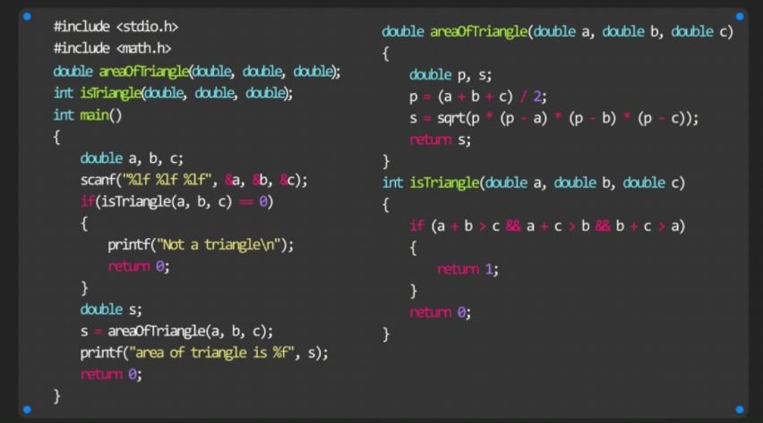

# 函数

### 函数类型void

```c
void function(void) //括号内的void可省略
{
    printf("e");
    printf("e");
    printf("e");
    printf("e");
    printf("e");
    return; //可省略return；
}
```

**无**返回值的函数：**void**

### 函数声明



**在int main前面**加上**函数头**，这样执行main函数时就知道定义在下文的函数了

**声明时，变量名可省略**

==函数声明可以多次，函数定义只能一次==