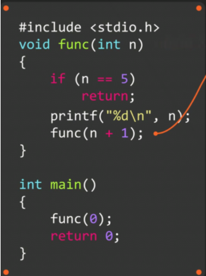
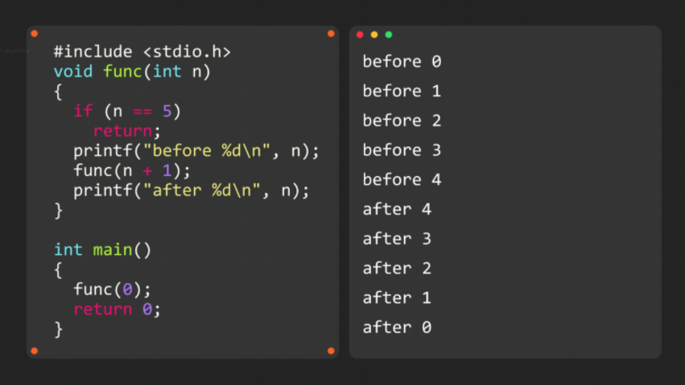

# 函数递归

### 函数内部调用自己

```c
void func(int n)
{
    printf("%d\n", n);
    func(n + 1);
}
int main()
{
    func(0);
}
```

若陷入这样的死循环，使用 ==ctrl+c== 结束程序

函数结束，使用==return==



### ==递归与回归==




放在递归调用==前==的语句将在==递归==过程中==顺序==执行，放在递归调用==后==的语句将在==回归==过程中==倒序==执行

