# 指针

### 内存地址

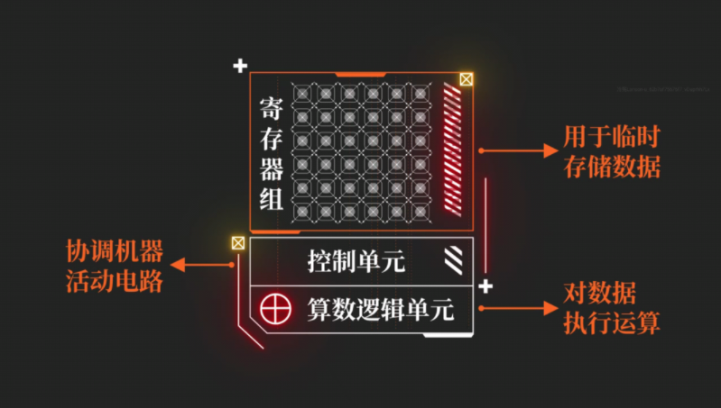

寄存器组只保存当前正在处理的数据，处理后的数据保存到内存中

先从内存中获取数据放到寄存器组中，然后交给算数逻辑单元，算完的结果先放到寄存器组中，然后再放到内存里

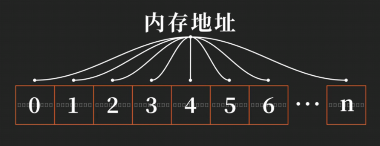

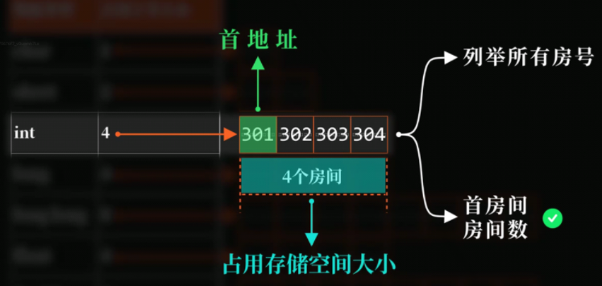

记录 ==首地址+占用存储空间大小==  即可

### 指针数据类型

取地址运算符&：获取数据对象首地址和所需存储空间大小

### 指针类型声明

==目标数据类型 * 变量名==

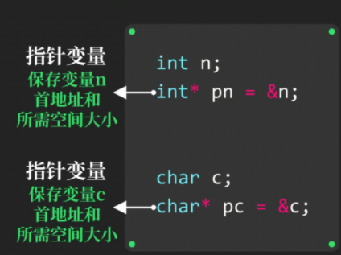

**将`pn`称为n的指针，或者是`pn`指向n**

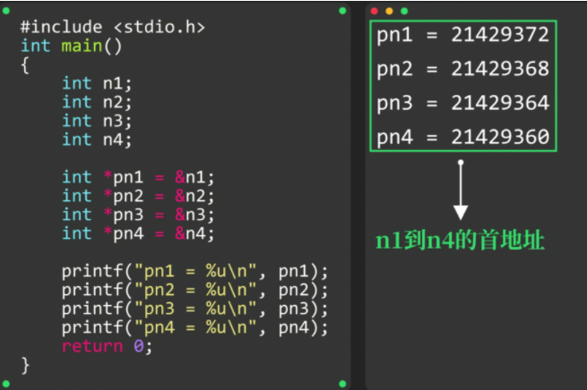

**指针类型的值**是目标数据对象的==首地址==

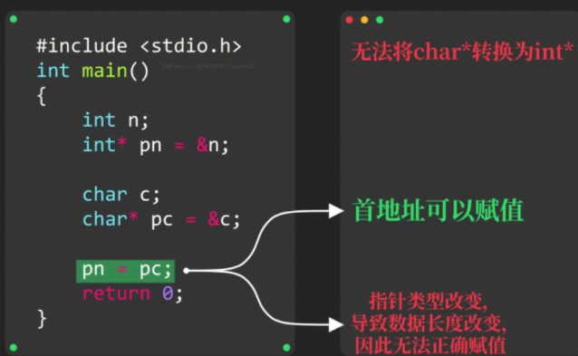

### 使用指针

**取值运算符***

用法：  ***指针**，  根据指针中存储的首地址和空间大小找到目标数据对象

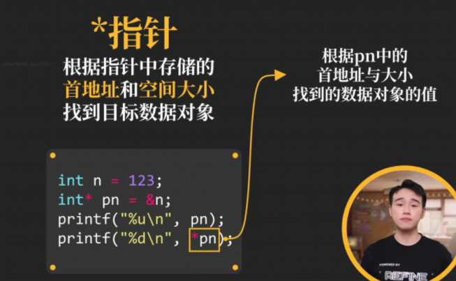

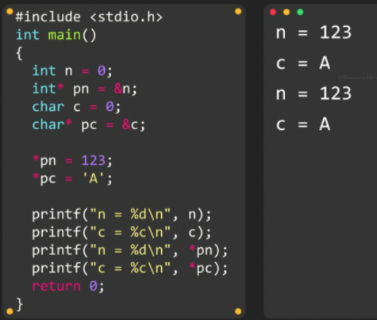

### ==指针类型==占用空间大小

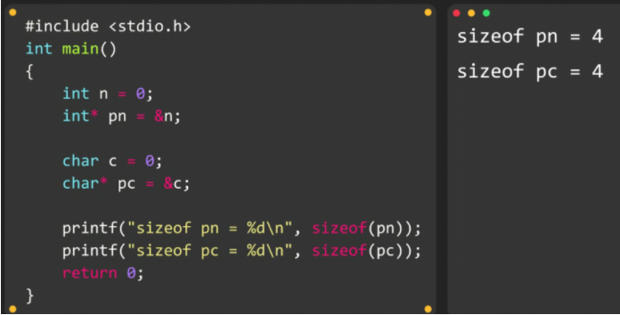

`pn和pc`存储的均为**数据对象地址**

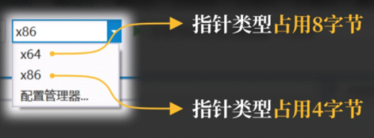

### 强制转换指针类型

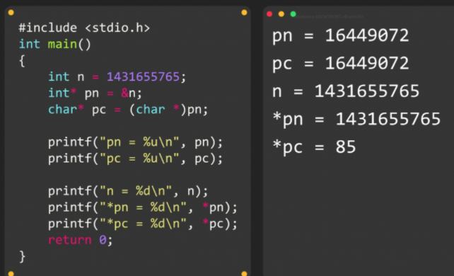

### ==指针大小==

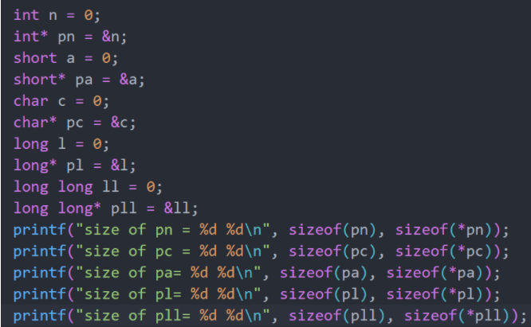

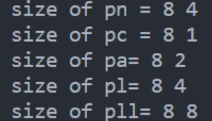

**指针类型和指针指向的数据类型是==不同的东西==**

**指针**用来**表示内存地址**，**指针指向的数据类型**，就是我们常见的**int char**等数据

**指针类型**就像**门牌号**，**指针指向的数据**表示**房间**，==门牌号与房间里能住多少人没有关系==

