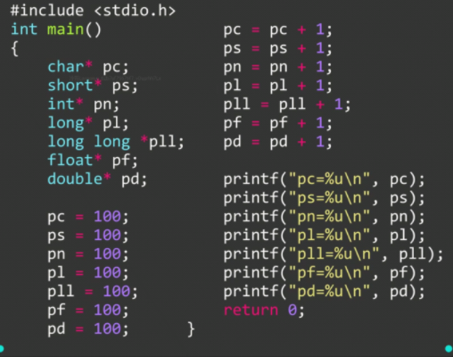
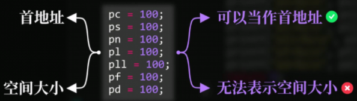
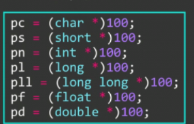
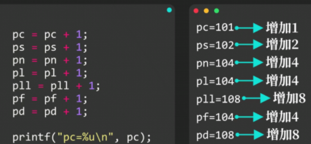
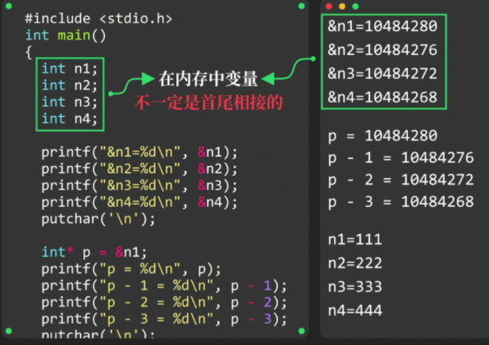
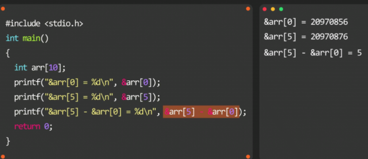

# 指针运算

### 指针类型与整型加减

将其强制转换：

==指针类型加1==后，将==首地址==向==后==移动了`sizeof`(==指针指向的目标数据对象==)个字节，**减同理**

`sizeof`(==指针指向的目标数据对象==)，**称为  ==步长==**

指针类型**加减n**后，其首地址向**后前**移动 **n * 步长** 个字节

### 应用指针类型和整型加减

取值运算符的优先级**高于**算术运算符，需**先让首地址移动**，再进行取值操作 `*(p - 1)`

### 同类型指针减法运算

指针类型相**减**后，结果为**两个首地址差值**==除以==**步长**

同类型的指针相加/乘除、指针类型与整型进行乘除运算，这些**都没有实际意义**

