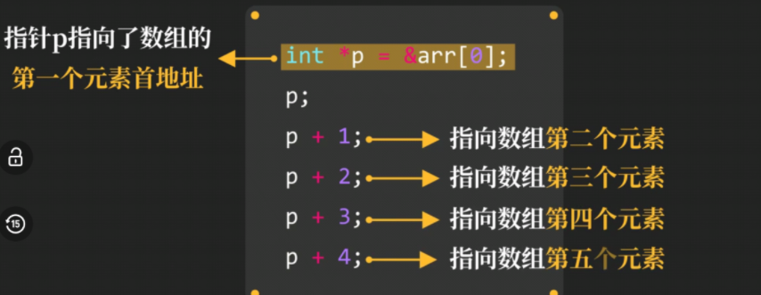
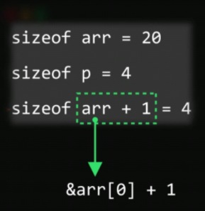
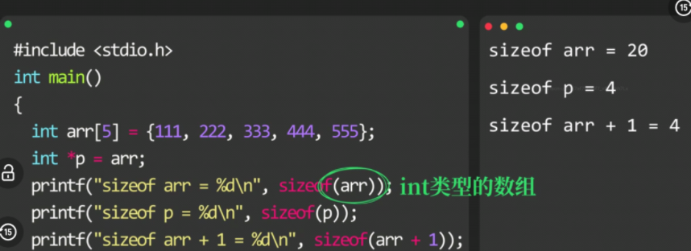
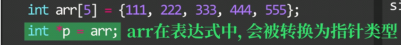
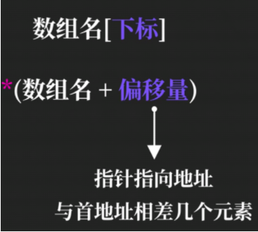
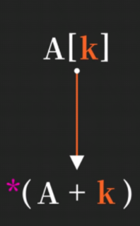
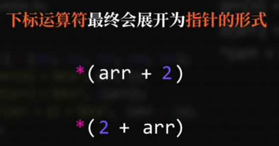

# 指针与数组



### 数组名获取数组首地址

```c
int arr[5] = {111, 222, 333, 444, 555};
printf("arr = %u\n", arr); //arr的值为首地址
printf("&arr[0] = %u", &arr[0]);
```

**`arr`的值是首地址**

当数组名出现在**表达式**中，**数组名**将会转换成为**指向数组第一个元素的指针**



==两个例外：对数组名使用`sizeof`时；对数组名使用取地址运算符&时==





### 获取数组元素的方法





编辑器会将**中括号形式转换为指针形式**



```c
int arr[5] = {111, 222, 333, 444, 555};
printf("%u", arr[2]);
printf("%u", 2[arr]);
printf("%u", *(arr + 2));
//以上均输出 333
```
