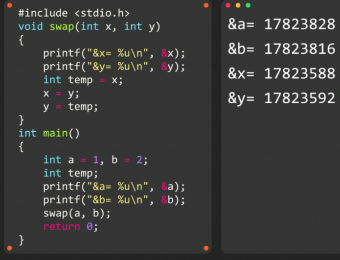
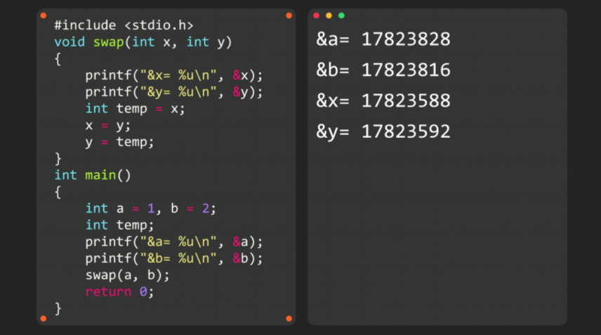
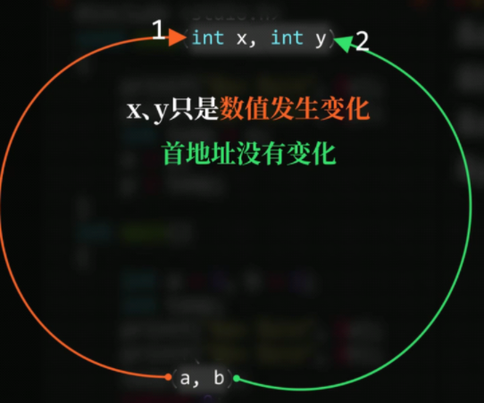
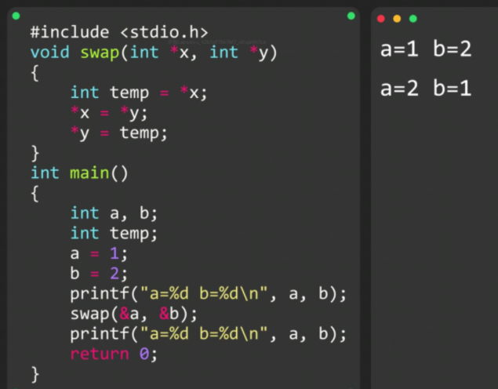
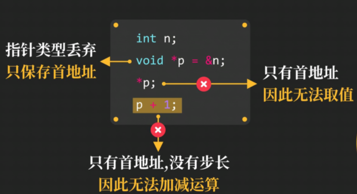
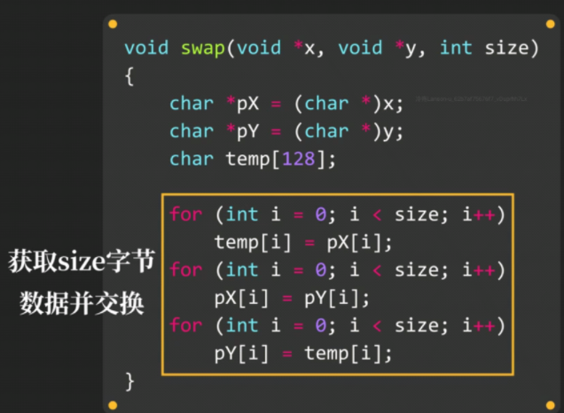

# 指针作为参数传递



### 形参和实参相互独立





==`xy`只是数值发生变化，首地址没有变化==

### 指针作为参数传递

被调函数**无法直接修改**主调函数变量

不传数值，而传首地址？



此举**只能交换int类型**的数值！！！

### 为什么`scanf`需要&

```c
scanf("%d", &n);
```

`scanf`**是被调函数**，**无法直接修改在主调函数中**的变量n

通过指针，可以间接修改变量n

### void*类型指针

将int*类型指针改为void\*类型指针

void*类型指针**只保存首地址**，不保存存储空间大小

==无法对void*类型指针进行取值，也没有步长==

所以也**无法对其进行整型加减**



**任意类型的指针都可以直接赋值给void*类型指针**



**可以用这种方式交换更多类型变量**