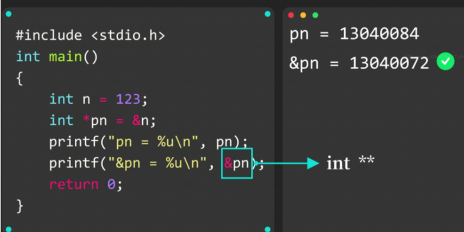
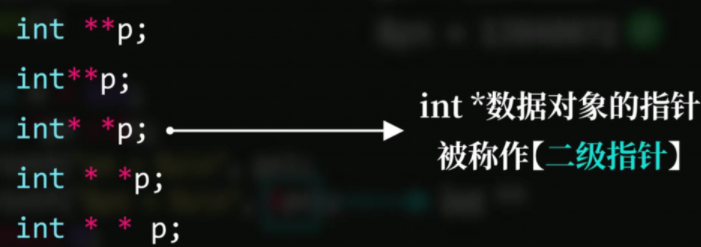
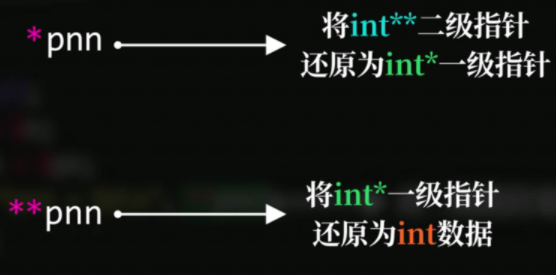
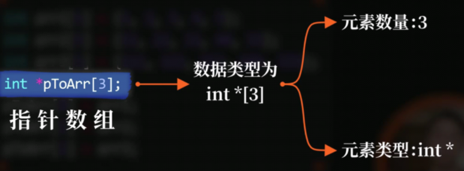
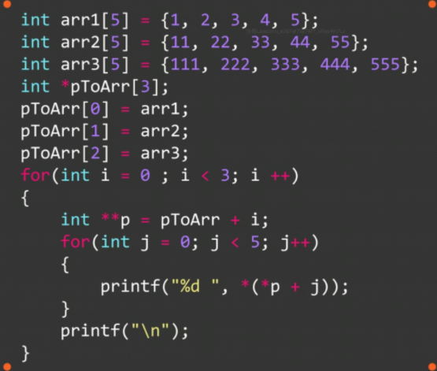
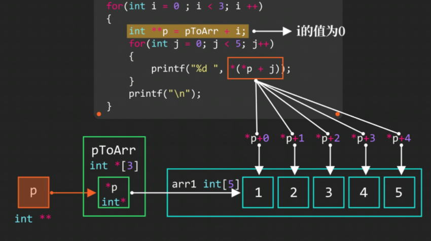
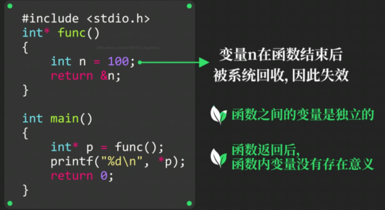
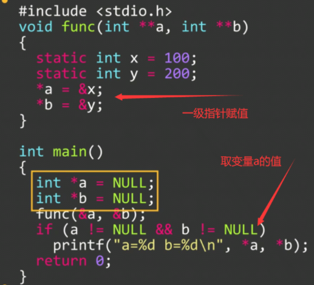

# 多级指针和指针数组







### 指针数组



```c
int arr1[5] = {1, 2, 3, 4, 5};
int arr2[5] = {11, 22, 33, 44, 55};
int arr3[5] = {111, 222, 333, 444, 555};
int *pToArr[3];
pToArr[0] = arr1;  //指针数组第一个元素存储arr1数组第一个元素的首地址
pToArr[1] = arr2;
pToArr[2] = arr3;
```

### 使用指针遍历数组





### 从函数中返回指针

必须**int* 函数名(){}**  ==int*的\*不能漏！！！==



**函数结束后变量n被回收，再去访问变量n可能失效**

如果不想变量被回收，需在前面加上**static**，这样，函数结束，变量n也不会被系统回收

```c
int* func(){
    static int n = 100;
    return &n;
}
int main(){
    int *p = func();
    printf("%d", *p);
}
```

### 从函数中返回多个变量


==将指针内保存的地址设为0==，即==&NULL = 0==



==两处*a用法不一样==

### 使用二级指针的原因

C语言中实参的调用原理：**将实参复制一份副本，将副本的数据传入形参中，所以需要使用指针将副本的内存地址改变，才能改数值**

所以如果要在一个函数内改变一个数的值，那么就需要将**形参定义为指针**。同样的，如果我们要在一个函数内改变一个指针的值，我们就需要**将形参定义为二级指针**
