# 指针与多维数组

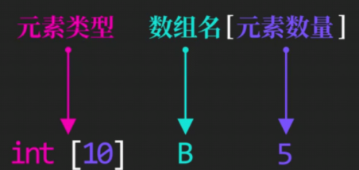

**注意多维数组中[]的顺序**

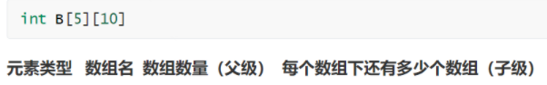

不能这么写 `int* pB[10]` 这样写就是**指针数组**了

指针数组是一个**数组**，数组指针是一个**指针**

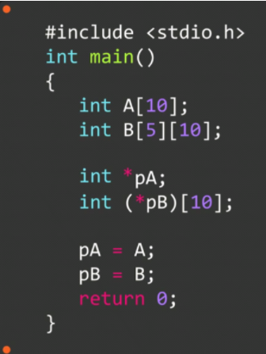

注意是`int (*pB)[10]`，不是`int*(pB)[10]`

### 数组指针移动和取值

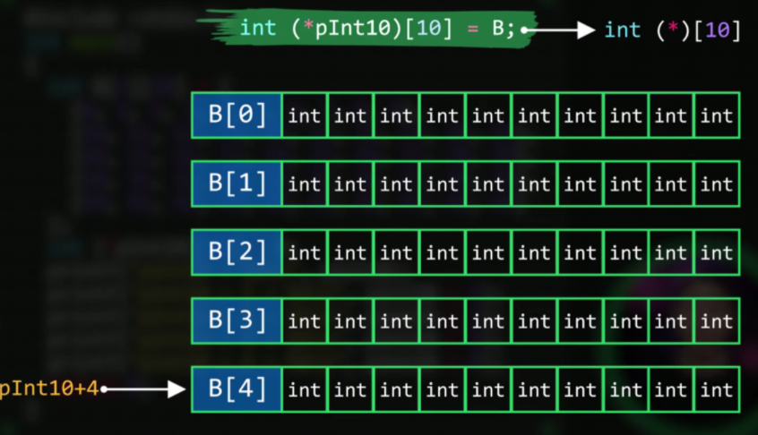

==这里的int (*pInt10)[10] 意思是 **10个元素为一组，一组里面有10个元素，而不是有10组**==

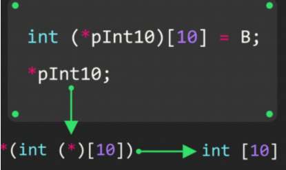

***(int\*) = int     *(int (\*) [10]) = int [10]**

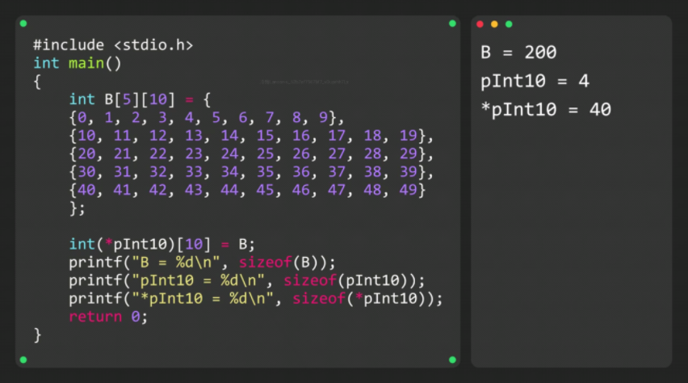

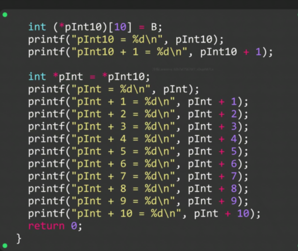

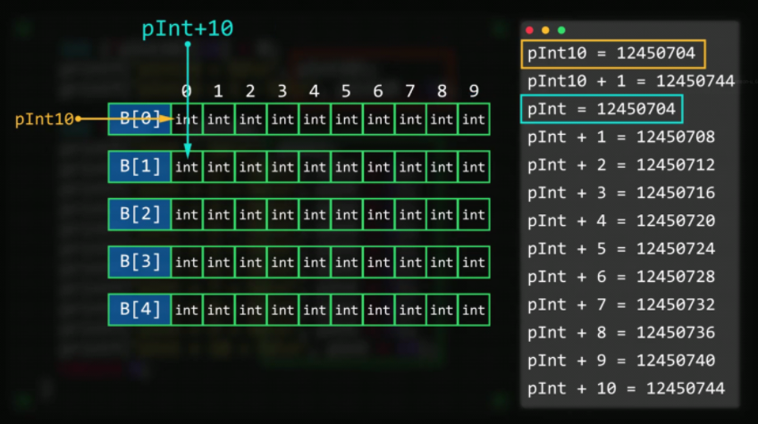

### 对数组取地址

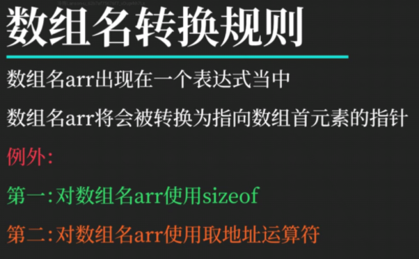

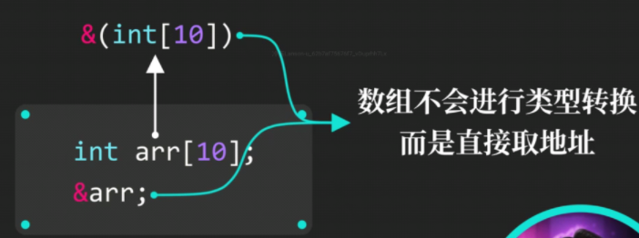

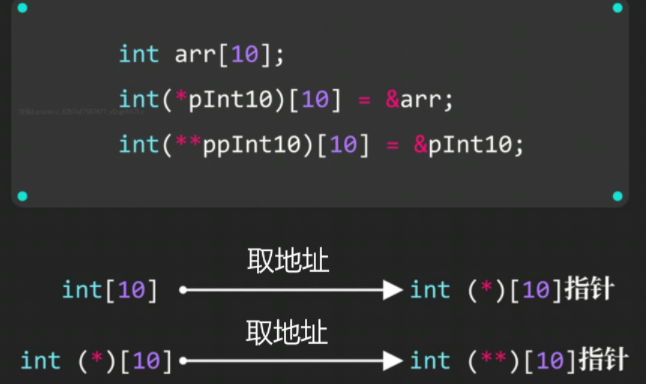

注意：==`&&arr`是错误的==  ==`&arr`是一个临时数据对象，必须将其赋值给变量==

