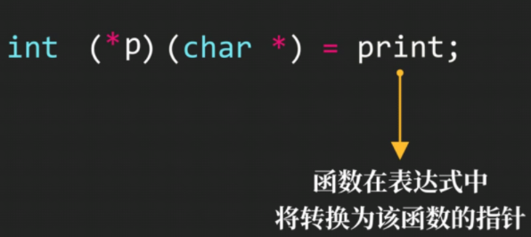

# 函数指针与数组

### 指向函数的指针

==char *a  指向字符串a的首元素==

**int (*p) (char *) 声明函数指针**



### 使用指向函数的指针


**要先加括号将p取值**


**两种方式均可**

### 函数指针数组

```c
void (*funcarr[4])() = {函数名1, 函数名2, 函数名3，函数名4}
for (int i = 0; i < 4; i++){
	(*funcarr[i])();
}
```


函数指针再加（）**就可以直接调用函数**