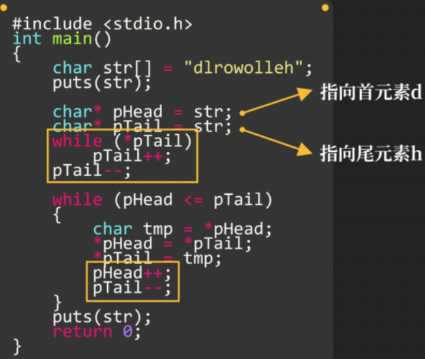

# 字符串和字符指针

### 字符串常量不可修改

**字符串实质是一个字符数组**

```c
char *pstr = "HelloWorld\n";
pstr[0] = 'h';   //报错   字符串常量不可修改
```

### 字符数组

**使用字符数组装载字符串**即可**修改字符**


### 字符数组和指针


==特别注意，不要这么写==


**打字符串数组命令:puts(数组名)**

### 使用指针处理字符串



### 字符数组修改与复制

**`strcpy`函数**

需在头文件中加入`<string.h>`

```c
#include <string.h>
char str1[15], str2[15];
strcpy(str1, "demo1");
strcpy(str2, "demo2");
puts(str1);
puts(Str2);
```

`strcpy(arr_name,change_string)`