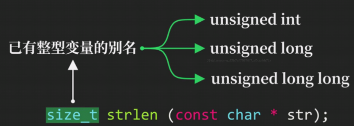
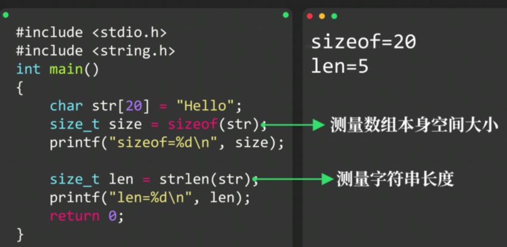
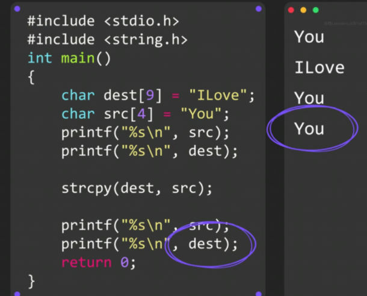

# 字符串处理函数

**需引入头文件`<string.h>`**

### 获取字符串长度`strlen`函数

**==`sizeof`==**关键词**返回的结果**也是 ==**size_t**== 类型

### 字符串拼接函数 **`strcat`**

将**源字符串**拼接到**目标字符串==后面==**

**数组越界！**

### 字符串复制函数`strcpy`

**完全清空，再复制进去**

### 字符串比较函数`strcmp`

用于比较两个字符串，若**一致则返回0**

**若ASCII码 str1 > str2 则返回1**，**否则返回 -1**

### 自己实现字符串函数时

==**一定要检查指针是否为NULL！！！**==
