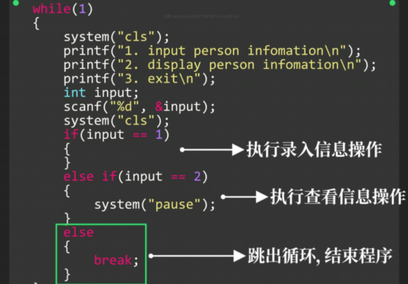

# 结构化数据

### 人员信息管理系统

**增删改查**

### 使用数组存储数据


### 交互式程序


**清屏**

```c
#include <stdlib.h>
int main(){
    system("cls");
}
```



### 聚合数据

==struct==

```c
struct {
    char name[];
    int sex;
}arr[10];
```


**类似于声明Int数组一样，将int替换为struct即可声明结构数组**


