# 结构

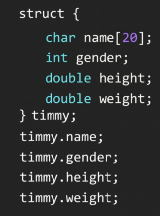

​                      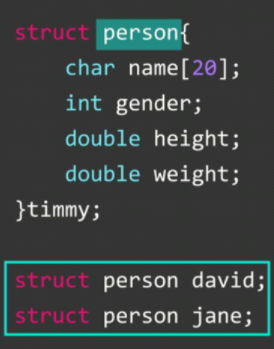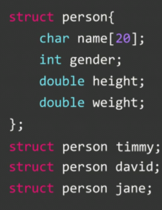   

**框框处的struct可以省略**  但==定义时 struct 不可省略==

==**struct 后 要加分号;  ！！！**==

### 初始化结构

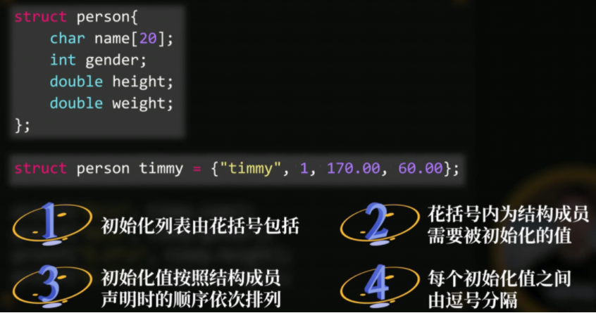

### 结构数组

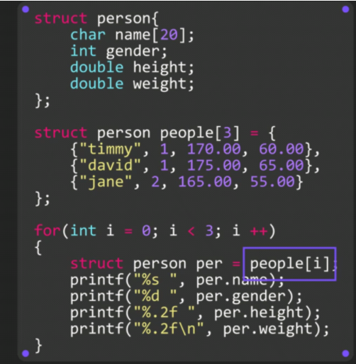

### 嵌套结构

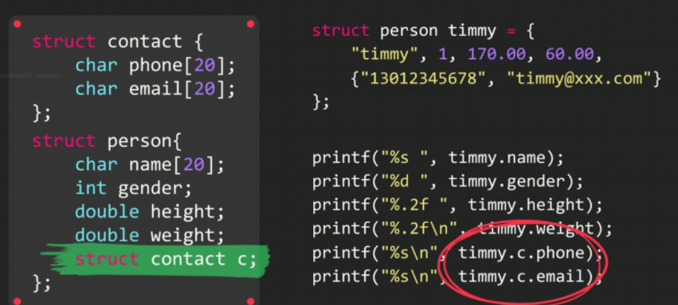

### 指向结构的指针

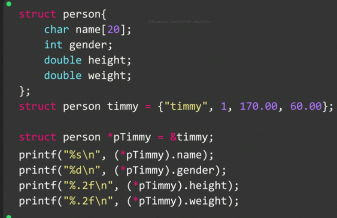

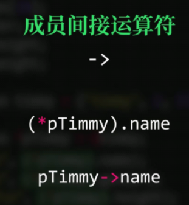

**两者等价**

### 结构在函数中传递

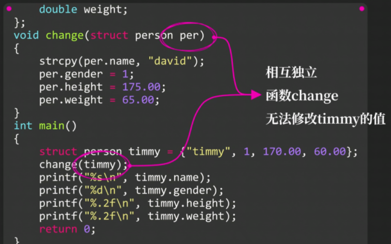

**但是如果改为指针，结果就不一样了**

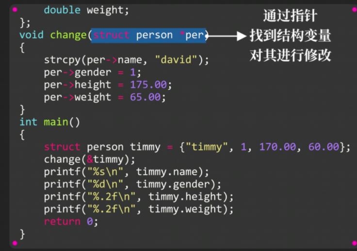

**把struct当函数返回类型，这么写亦可以**

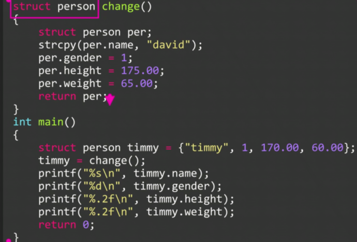