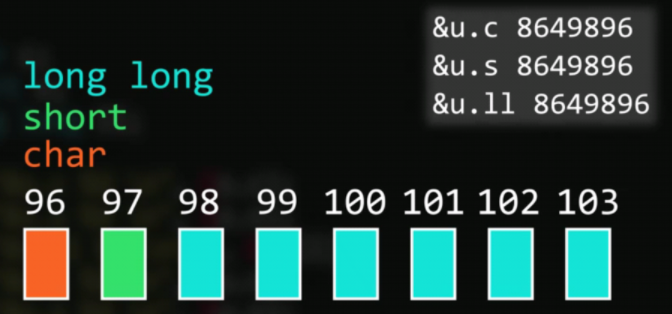

# 联合和枚举

### 联合

```c
union{
    char c;
    short s;
    long long ll;
}u;
```



**联合的大小**，为联合中==最大成员==的大小

```c
struct{
    char c;
    shorts;
    long long ll;
}s;
```


联合共用一段内存，大成员数据将覆盖小成员数据


​															==**内存对齐**==

### 联合应用举例


**这样留空2个，浪费内存**


**不占用多余内存**

```c
void printMsg(struct message msg){
    switch(msg.type){
        case 1:
            printf("%d", msg.u.n);
            break;
        case 2:
            printf("%f", msg.u.f);
            break;
        case 3:
            printf("%s", msg.u.str);
            break;
    }
}
```

### 枚举  `enum`


### 声明枚举类型

**注意是逗号不是分号**

```c
enum msgType{
    eInterger,
    eFloat,
    eString
};
```


**枚举默认从0开始递增**


这样就从1开始递增了


也可以指定枚举中每个成员的数值

### 枚举应用


```c
enum sexList{
    man=1,
    woman,
    alien
};
struct{
    char* name;
    int age;
    enum sexList sex;
}Lanson;
Lanson.sex = man;		
printf("%d", Lanson.sex);   //输出1
```

**注意这里`Lanson.sex` = man 的 man 直接写，不用加双引号**

```c
enum sexList{
    man,
    woman,
    alien
}sex;   //这样写是无效的
```

==这样写是无效的==，花括号后**不加名字**

```c
enum sexList{
    man,
    woman,
    alien
};
printf("%d", alien); //otput:2
```

这么写是对的

```c
enum sexList{
    man,
    woman,
    alien
};
printf("%d", sexList.alien);
```

**这样写是错的**