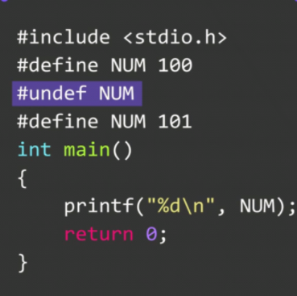

# 预处理指令


### 带参数的#define


```c
#include <stdio.h>
#define MEAN(a, b) (a + b) / 2
int result = MEAN(2, 4);
```


**和预期结果不符？**


**不带括号！**


**这么修改就是正确答案了**


**宏函数的参数应当作为一个整体，优先运算**

**宏函数展开后的表达式应当作为一个整体**

**如果宏函数的替换体内多次使用参数**，==不要使用自增、自减表达式==

### 宏函数内两个有用运算符

### 井号#


宏函数参数会  **替换 ** 替换体内的参数

但如果在替换体的参数前加上**#**，会自动在替换体参数**两端加上双引号**，形成**字符串**

```c
#define FMT(varname) "The value of " varname " is %d\n" //预处理中
FMT(number); //main函数中
```

没加#，结果为

```c
#define FMT(varname) "The value of " varname " is %d\n" //预处理中
"The value of " number " is %d\n";
```

加了#号是这样的

```c
#define FMT(varname) "The value of " #varname " is %d\n" //预处理中
"The value of " "number" " is %d\n";
"The value of number is %d\n"; 			//两者等价
```


==相邻字符串会被自动连接成一个完整字符串==


**无法符合`printf`函数第一个参数必须是字符串的规则**

### **双井号##**

**将替换体中的两个记号组合成一个记号**


**是否有##的差别**

### 取消宏定义


**用#undef 宏   来取消宏定义**



