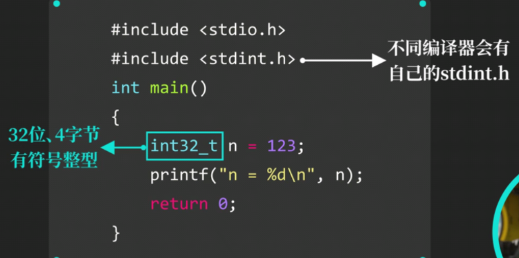

# typedef关键词


```C
typedef int int32_t;
int32_t n = 123;
printf("n = %d\n", n);  //output:123
```


这种**不需要加struct**

### typedef和#define的区别

**#define可以为值设置一个别名**，但typedef不行

#define由**预处理器处理**，并且修改替换代码

typedef不受预处理影响，**在编译时由编译器处理**


而**用typedef定义就不会出现这样的情况**

### 提高整型可移植性


**整型类型的别名无需自己定义**，编译器会根据本平台的整型范围大小，设置对应的别名，只需要**包含头文件stdint.h**




**printf函数参数如何保证可移植性？**


需要另一个**头文件  inttypes.h**


