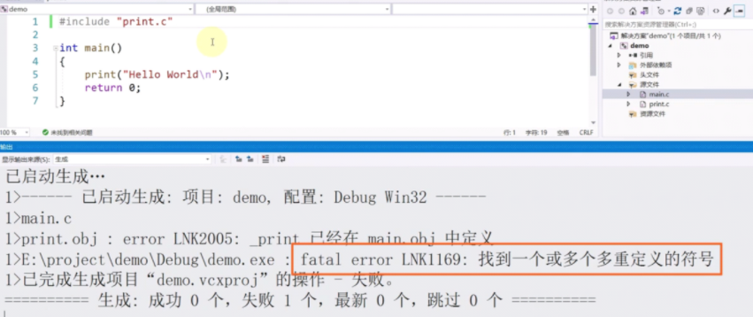
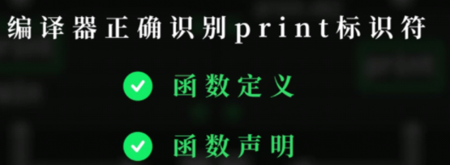
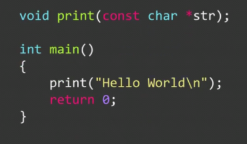
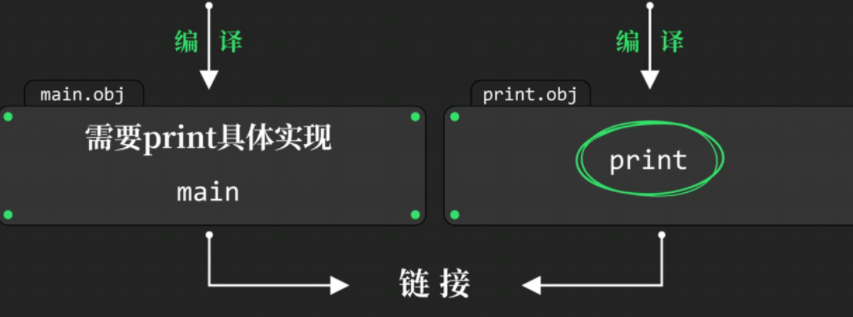
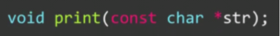

# 多文件代码

### 预处理指令#include

### 多文件代码

在visual studio中新建源文件`print.c`，并编写print函数，再在头文件中引入

若写的是`#include <print.c>`，会报错，因为只在编译器包含目录中搜索

所以要写`#include "print.c"`

却出现了LNK（link）报错

**代码到可执行文件的构建构成**

先**预处理**：执行预处理指令，修改源代码

然后**编译**：将预处理后的源代码转换为**二进制目标文件**

最后**链接**：将需要用到的目标文件合并成**可执行文件**

解决办法如上，**在main函数前添加函数声明**

但如果有特别多的函数，这样写就太麻烦了，所以我们直接在**==头文件==中加入这些函数声明即可**

在visual studio中加入头文件 **`print.h`** 在头文件中写入函数声明

再在`main.c`中引入头文件#include `<print.h>` 即可