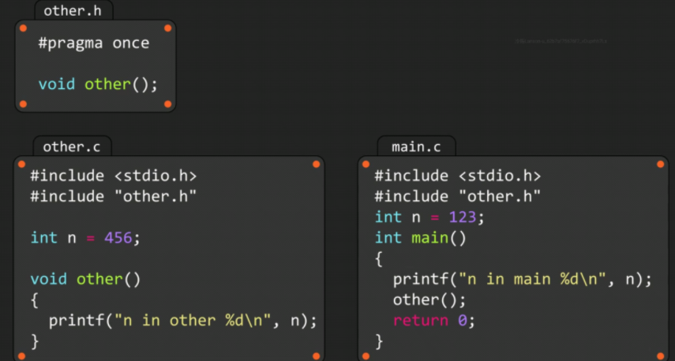

# 存储类别

### 自动变量

声明在**代码块内的任何变量**，都属于**自动存储类别**的变量

可以加auto关键词声明自动变量

### 文件作用域内的静态变量

### 外部链接的静态变量

**有两个变量n，链接失败**

若在main中声明了，那么可以在other中用 **==extern==** 关键词，链接全局变量n

**交换位置也行**

### 仅限本文件使用的全局变量

这里的 **static** 指拒绝与其他文件共享全局变量n

