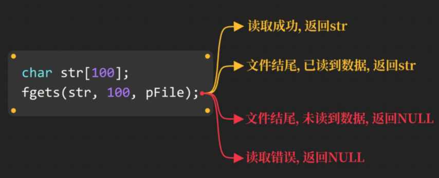

# 文件

### 创建并写入文件

### 创建或打开文件`fopen`函数

原型：

```c
FILE *fopen(const char* filename, const char* mode)
```


```c
FILE *pFile = fopen("data.txt", "w");
if(pFile == NULL) return -1; //判断是否成功创建文件
return 0;
```

### 输出字符串到文件`fprintf`函数

原型：

```c
int fprintf(FILE* stream, const char* format, ...);
```


### 关闭文件`fclose`函数

```
int fclose(FILE* stream);
```


### 文本模式和二进制模式


如果不想要这种模式，只要在打开文本函数的第二个参数里写 **`wb` 或 `rb`**


### `fscanf`函数读取文件

原型：

```c
int fsacnf(FILT* stream, const char* format, ...);
```


\n字符给了**`ch`**变量  使用**`fgetc`**函数吸收\n

原型：

```c
int fgetc(FILE* stream);
```


### 读取字符串fgets函数

原型：

```c
char* fgets(char* str, int num, FILE* stream);
```




fgets函数**读每一行**，**若读到数据，则继续读取**，若**没有读到数据**，则**返回NULL**

### 写入文件

### fputc函数

原型：

```c
int fputc(int character, FILE* stream);
```


**写模式：将原文件清空再写入**


**用追加模式则不会**

### fputs函数

原型：

```c
int fputs(const char* str, FILE* stream);
```


C语言写入原理：  **缓存**


刷新缓存后才会被写入文件中，否则一直在文件缓存内


### 文件偏移


### fseek函数 偏移文件位置

原型：

```c
int fseek(FILE* stream, long offset, int origin);
```


**从开头偏移5**


**从结尾偏移5**

### 获取当前文件指针位置  ftell函数


==此举即可获得文件字节大小==

### rewind函数  将文件指针回到文件最开始


### 更新文件


### fwrite函数  将数值以二进制形式保存  

原型：

```c
size_t fwrite(const void* buffer, size_t size, size_t count, FILE* stream);
```


### fread函数  从文件中读取二进制

