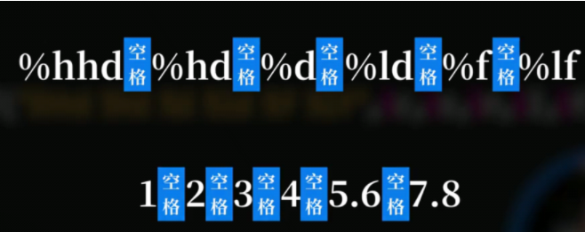

## Scanf函数

`第一行：键盘输入值，第二行：转换规范，第三行：&+变量名`

scanf函数将键盘输入值存储至变量中

$\textcolor{Red}{需要严格一一对应，包括间隔的符号} $




**存放到基本变量中时，需在变量名前加\&，若存放到数组中，则不用**


$\textcolor{CornflowerBlue}{\%d 若输入字符，则将字符转为ASC码}$

$\textcolor{CornflowerBlue}{\%c若输入数字，则将数字（ASC）码转为字符，若输入字符，则为单字符打印（需用单引号''）}$

$\textcolor{YellowOrange}{字符数组不加\&}$


### ==scanf函数的特别参数==

当我们输入hello world的时候，scanf**只会获取到hello**，这时我们就要用到scanf函数的参数了

```c
char str[20];
scanf("%[^\n]s", str);
printf("%s", str);
```

其中，**[]表示匹配规则**，**^代表补集**，意为除了\n（回车）不匹配，其他的全部匹配