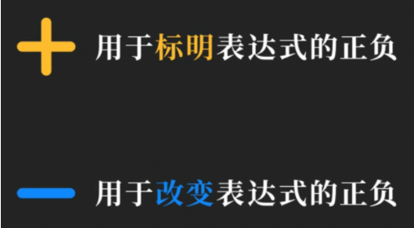
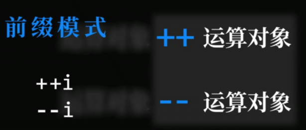
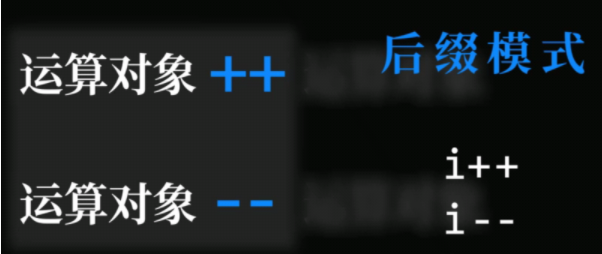
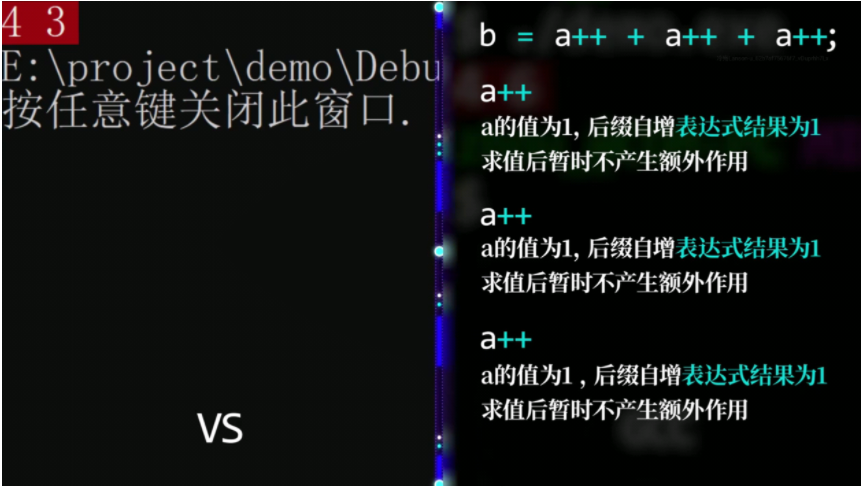
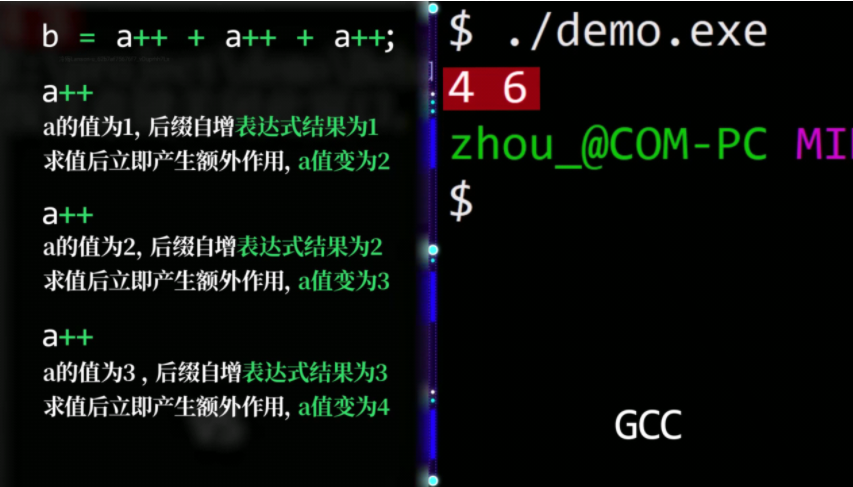
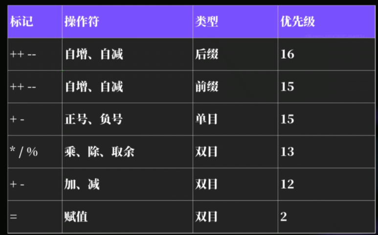

## 运算符和表达式

表达式必须以语句形式才能单独存在，如

```c
100;
5 + 10;
a / b;
a * 10 / b + c;
```



```c
#include <stdio.h>
int main()
{
    int a = -100;
	printf("%d",+a); //-100
	printf("%d",-a); //100
}

```

整型与整型进行运算，结果仍然是$\textcolor{Red}{整型} $，结果中的$\textcolor{Red}{小数会被丢弃} $，称作$\textcolor{Red}{截断} $

```c
#include <stdio.h>
int main()
{
    int a, b;
    a = 5;
    b = 2;
    float c;
    c = a / b;
    printf("%f", c); //输出2.000000,截断
    return 0;
}
```

```c
#include <stdio.h>
int main()
{
    float a, b, c;
    a = 5;
    b = 2;
    c = a / b;
    printf("%f\n", c);//输出2.500000，正确
    return 0;
}
```

#### 求余运算符%

算法：判断奇偶数，若%结果为0，则为偶，为1为奇

#### 自增、自减表达式





```c
#include <stdio.h>
int main()
{
    int a = 10, b = 10;
    printf("%d", a++, b--);//output:10, 10
    printf("%d", a, b);    //output:11, 9
}
```

```c
#include <stdio.h>
int main()
{
    int a = 10, b = 10;
    printf("%d", ++a, --b);//output:11, 9
    printf("%d", a ,b);	   //output:11, 9
}
```

#### 不同编译器VS和GCC对自增自减产生额外作用时机不一样





VS$\textcolor{RubineRed}{累计所有子表达式求值完成后}$才会进行额外作用

GCC$\textcolor{CornflowerBlue}{每完成一个子表达式就会立即}$产生额外作用

为了避免不同编译器导致自增、自减结果不同，==不要在一个表达式中写多个自增自减子表达式==

#### 运算符优先级

先括号，再乘除，最后加减



优先级越高，越先开始运算，$\textcolor{Magenta}{i++先于++i}$