[toc]

# 前言


## 特点


## jvm：java虚拟机


## 什么是 JDK JRE


# 第一章 Hello World(注意事项)


**src中存放.java文件，out中存放.class文件**


**这两个名字要一样**


**一个源文件中最多==只能有一个public类==。**其它类的个数不限，也可以将main方法写在非public类里，然后指定运行非public类，这样入口方法就是非public的main方法


回车后光标移到最前，即韩，再将韩替换北，顺替换京

## 注释


**类、方法的注释，要以javadoc的方式注释**

# 第二章 DOS Java API  类的组织形式 和 IDEA

## DOS


## Java API


## 类的组织形式


## IDEA

### 快捷键

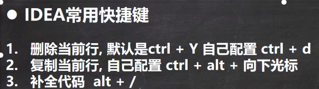


### 模板


# 第三章 变量

**声明字符串：  String 不是 string**


**运算顺序从左到右**

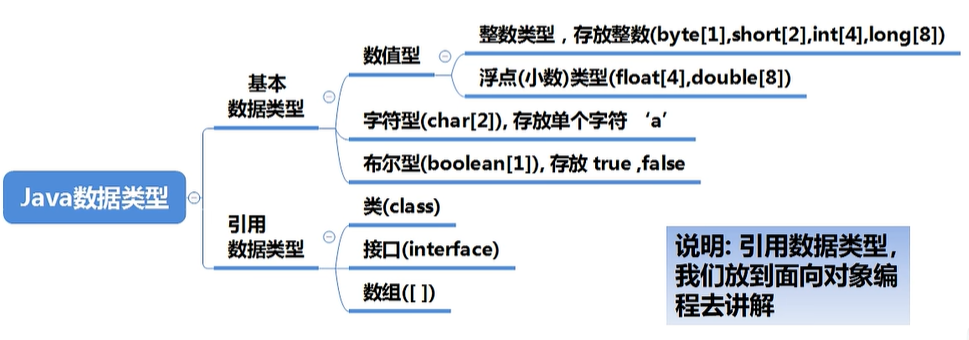


**浮点数由符号位+指数位+尾数位构成，尾数部分可能丢失，造成精度损失**


## 浮点数陷阱


**当我们对运算结果是小数的进行相等判断时，要小心**

**应该以两个数的差值的绝对值在某个精度范围内判断**

### Math.abs API


返回绝对值

## 编码


## 布尔类型  boolean

**==不可以==0或非0的整数替代false和true,这点和C语言不同**

## 自动类型转换


这么写错的

这么写就是对的


**(byte, short) 和 char 之间不发生类型转换**


**boolean不参与转换**


## 强制类型转换


**只对10进行了转换**


## 基本数据类型和String的转换


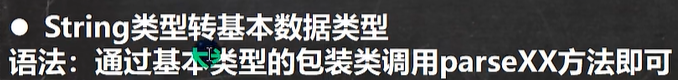


# 第四章 运算符

## 取模


**==a % b = a - (a / b) * b==**    

## instanceof


## 逻辑运算符


## 命名规范


# 第五章 键盘输入和进制

## 输入


## 进制


### 八转十


### 十六转十


### 十转二


但一个字节有8bit，所以还得在前面补两个0 		**0B00100010**

### 十转八  十转16

形同十转二，只不过  **除8 除16 而不是  除2**

### 二转八


### 二转十六


### 八转二（二转八逆向）


### 十六转二（二转十六逆向）


## 原码 反码 补码


计算机运算的时候，都是以==**补码方式运算**==             **结果以==原码==方式展现**

## 位运算


**重点**	**反码和按位取反不同**  反码是符号位不变，其他取反，而按位取反是每一位都取反


**所以 二分，快排里的mid = l + r >> 1  本质就是 (l + r) / 2，只不过位运算更快**

# 第六章 分支与循环

**和C C++一模一样**							

## switch细节


## Math.random()

Math.random()  **返回[0, 1)的数**


**返回 [0，99] 的整数**

## break 和 continue注意事项


**label1 label2名字并不固定，满足命名规范即可**


# 第七章 数组

**数组是引用类型**，所以是引用传递，引用赋值

## 定义数组

### 一维数组

`int[] arr = {0, 2, 4, 6, 8};`


**int arr[] 和 int[] arr   一样** 


### 二维数组


Java 二维数组比较灵活，列数可以不确定，可以这样


# 第八章 类与对象

## 定义与实例化

**定义：**			

**实例化：**		

## 内存中对象的存在形式

**如果是基本数据类型，直接存在堆里，否则，存入方法区的常量池中**


**成员变量=属性=field(字段)**


## 对象内存分配机制


## 成员方法（方法）


**调用**      

### 方法调用机制


### 访问修饰符


**方法不能嵌套定义**

### 同一类中的方法调用


### 跨类调用方法


### 汉诺塔


### 方法重载（要求形参列表不一致）


### 可变参数


类似于ES6的	**...解构**

**可以将nums当作数组使用**

**一个形参列表中只能出现一个可变参数，且在形参列表最后**

**全局变量可以加修饰符，局部变量不可以加修饰符**

## 构造方法/构造器


**构造器==没有返回值==**		new的时候会调用构造器

**作用：完成对新对象的初始化**


**构造器可以重载**

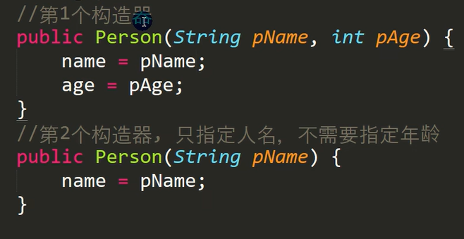

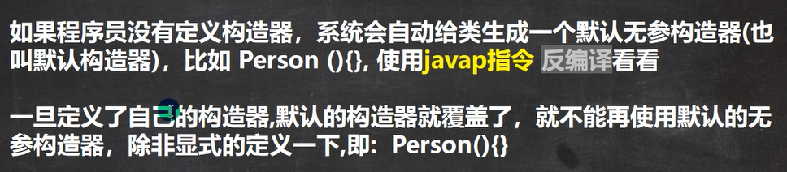


定义完构造器后，默认的无参构造器就失效了，不传参数会报错，除非显式定义一下无参构造器			public可以不写


## this


**this.name  ->  当前对象的属性**

### 注意事项


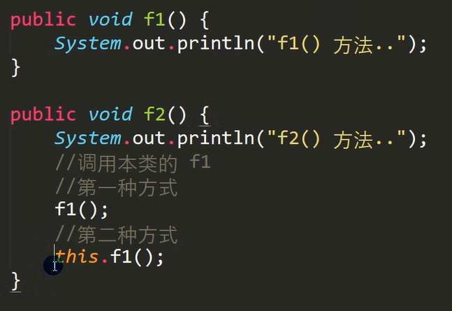

具体区别详见  继承

**4.只能在构造器中访问另一个构造器**


先无参构造器，又this调用了有参构造器


### String.equals()方法


# 第九章 包


**com一级目录 hspedu 二级目录**  以此类推  以 **.** 分割

## 包的本质 


## 调用不同包下的相同类


## 命名规范


## 常用包


**需要用到哪个类，就导入哪个类，不建议导入全部类**


需要引入array包


## 注意事项


## 访问修饰符


**只有默认和public** 才能修饰类

**同包：**


**修饰符可以用来修饰类中的属性，成员方法以及类**

## 封装（encapsulation）

把抽象出的数据[**属性**]和对数据的操作[**方法**]封装在一起，数据被保护在内部，程序的其他部分只有通过被授权的操作[**方法**]才能对数据进行操作

**优点：隐藏实现细节，可以对数据进行验证，保证安全合理**

### 步骤：

**1.将属性私有化 private   让外部不能直接修改**

**2.提供一个公共的（public）set方法，用于对属性判断并赋值**

```java
public void setXxx(){
    //加入数据验证的业务逻辑
    属性 = 参数名
}
```

**3.提供一个公共的（public）get方法，用于获取属性的值**

```java
public XX getXxx(){
    return xx;
}
```

### 案例：


自己写太慢，我们用快捷键alt + insert


限制都在get和set里写

### 封装与构造器


防护机制失效

**我们可以将set方法写在构造器中，这样仍然可以验证**


## 继承（Extends）

**提高代码复用性**

### 基本语法

**class 子类 extends 父类{}**


### 细节

**父类private**


 非private的属性可以直接访问

**公共方法访问私有变量**

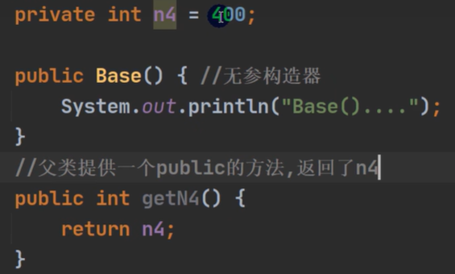


**子类必须调用父类的构造器，完成父类的初始化**


```java
public class Base{
    public Base(){
        System.out.println("父类Base()构造器被调用....");
    }
}
```

```java
public class Sub extends Base{
    public Sub(){
        System.out.println("子类Sub()构造器被调用....");
    }
}
```


**默认加了一个 super()   默认调用父类构造器**


如果父类没有提供无参构造器，则必须在  **子类的构造器**  中**用super去指定  父类的哪个构造器**  完成对父类的初始化工作


**super 和 this 必须放在第一行**

**Object 是所有类的父类**

输入 ctrl + h 可以看到所有类的子类

**父类构造器的调用将一直往上追溯到 Object 类**

**子类最多只能继承一个父类（直接继承），在java中是单继承机制**


### 继承的本质

**当子类对象创建好后，建立查找的关系**


#### 访问属性的关系


特别注意，不仅要求有属性，**还得要求可以访问**

### 案例：


a , b name , b

**要特别注意隐藏的super！**

### super

可以访问父类的属性，==**但不能访问父类的private属性**==        super.属性名


**super不限于父类，是上级类，一旦找到就break**

#### super 和 this 的比较


### 方法重写（override）

子类某个方法和父类（上级类）某个方法一样，覆盖


#### 注意事项


**子类方法不能缩小父类方法的访问权限**

### 重载和重写的比较


## 多态（polymorphic）

**提高代码复用性**		方法或对象具有多种形态

**方法的多态：重写/重载**

### 对象的多态

一个对象的**编译类型和运行类型可以不一致**

编译类型在定义对象时，就确定了，不能改变

运行类型时可以变化的

编译类型看定义时 = 号 的左边，运行类型看 = 号 的右边

前提：两个类存在继承关系


父类在等号左边，子类在等号右边，**父类的一个引用可以指向子类的一个对象**

### 案例：


### 向上转型


**本质：父类的引用指向了子类的对象**

**如  Animal dog = new dog();**

特别注意：向上转型，调用时 可以调用父类中所有成员，但**不能调用==子类特有==**的成员    		(catchMouse为cat特有)


**运行阶段从运行类型开始看**，此处运行类型为  **cat**

### 向下转型

语法：  子类类型  引用名  =  （子类类型）   父类引用

**只能强转父类的引用，不能强转父类的对象**

**要求父类的引用必须指向的是当前目标类型的对象**

​		即 向上和向下转型的双方都是一样的，一方 animal 一方  cat	

```java
Animal animal = new Cat();
Cat cat = (Cat) animal;
```

向下转型后 **可以调用子类类型中所有的成员**


**编译和运行类型都是  cat**

**属性没有重写！ ==属性的值看编译类型==**


与方法不同！


### **（！非常重要！）动态绑定机制**

详见韩顺平Java p315


**当调用对象==方法==的时候，该方法会和该对象的内存地址/==运行类型==绑定**

**当调用对象==属性==时，==没有动态绑定==，哪里声明，哪里使用**

### 多态数组

**数组的定义类型为父类类型，里面保存的实际元素类型为子类类型**


如此操作


### 多态的应用——多态参数

**方法定义的形参类型为父类类型，实参类型允许为子类类型**


## Object 类方法

#### == 和 equals 的区别


bObj 和 c 地址指向相同，所以是 true

**equals 只能判断引用类型**

**默认判断的是地址是否相等，子类中往往重写该方法，用于判断内容是否相等**


因为是new Integer 所以 == 比较的是两个对象，即地址是否相同

而因为Integer子类重写了equals方法（比较值），所以为true


String 同理  == 比较地址， 重写后equals 比较内容

#### hashCode

返回该对象的哈希码值，提高哈希表性能

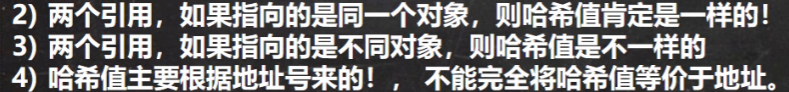


#### toString

默认返回  **全类名+@+哈希值的十六进制**


子类往往重写toString方法，返回对象的属性信息


##### 快捷键重写toString


直接输出对象，等价于toString


#### finalize

当对象被回收时，自动调用该对象的finalize方法，子类可重写

当某个对象没有任何引用时，jvm就认为这个对象是垃圾，将其回收，销毁对象前会调用finalize


直接 fina + tab 补全		↓默认


特别注意，**并不是一置空就回收**，当然也可以主动调用  System.gc()


实战中几乎不会运用finalize，多用于应付面试

## 断点调试

==断点调试中，以对象的**运行类型**执行的==


# 第十章 面向对象高级

## 类变量（静态变量）和类方法


jdk8以前，static存在方法区中的静态域中，jdk8后，存在堆中

static **类变量 在类加载时候生成**

语法：   访问修饰符 static 数据类型 变量名

当需要让**某个类的所有对象都共享一个变量**时，就可以使用类变量

静态方法访问静态属性


**开发自己的工具类时，可以将方法做成静态的，这样不需要实例化一个对象，就能直接使用**


### 注意事项

==**类方法中不能用this 和super  	类方法只能访问类变量类方法**==


## main方法

**java虚拟机调用main()**，所以必须是public

不必创建对象，所以是static

String[] args:  java 执行的程序 后面的参数


**静态main方法不可以访问本类的非静态成员**

```java
public class Main{
    private int n = 10;
    public static void main(String[] args){
        System.out.println(n); //错
    }
}
```

如果想访问非静态成员，要先创建一个对象 再调用

## 代码块


语法：   	[修饰符]{				

​						代码

​				   }

**修饰符要么不写（普通代码块），要么只能写static（静态代码块）**


### 普通代码块


**代码块的调用优先于构造器**

### 静态代码块

**static代码块**，作用是对类进行初始化，随着类的加载而执行，且**只执行一次**，但如果是**普通代码块，则每创建一个对象就执行**


**如果只是使用类的静态成员时，只会调用静态代码块，普通代码块==不会==执行**

总而言之，==**普通代码块**==在==**创建（new）对象时**==调用，且每创建一个就调用一次

而==**static静态代码块**==，在==**加载对象（3种情况）时**==调用，且只会调用一次

#### 类什么时候被加载？

创建对象实例（new）时

创建子类对象实例，父类也会被加载，而且父类先被加载，子类后加载

```java
public class test{
    public static void main(String[] args){
        AA aa = new AA();    //out:BB被加载\n  AA被加载
    }
}
class BB{
    static{
        System.out.println("BB被加载");
    }
}
class AA extends BB{
    static{
        System.out.println("AA被加载");
    }
}
```

使用类的静态成员（属性、方法）时

```java
public class test{
    public static void main(String[] args){
        System.out.println(Cat.n);  //out:Cat被加载 10
    }
}
class Cat{
    private static int n = 10;
    static{
        System.out.println("Cat被加载");
    }
    
}
```

### **（！非常重要！）创建对象时在==一个类==中的调用顺序**

**先调用静态代码块和静态属性初始化，且他们调用优先级一样，按定义顺序调用**


new A() 时，先将n1初始化，所以先调用getN1，再调用静态代码块

**再调用普通代码块和普通属性初始化，且他们调用优先级一样，按定义顺序调用**

**最后调用构造方法**

助于理解：构造器的最前面隐含了super()和调用普通代码块，所以静态相关的代码块和静态属性初始化是优先于构造器和普通代码块执行的


### **（！非常重要！）创建对象时在==继承类==中的调用顺序**


先加载（1、2），再创建对象（3-6）创建对象从子类构造器开始

```java
public class test{
    public static void main(String[] args){
		new BB();        
        //out: getVal1  AA的一个静态代码块被加载 
        //	   getVal3  BB的一个静态代码块被加载
        //	   AA的一个普通代码块被加载  getVal2  AA的构造器
        //	   getVal4  BB的一个普通代码块被加载  BB的构造器
    }
}
class AA{
    private static int n1 = getVal1();
    static{
        System.out.println("AA的一个静态代码块被加载");
    }
    {
        System.out.println("AA的一个普通代码块被加载");
    }
    public int n2 = getVal2();
    public static int getVal1(){
        System.out.println("getVal1");
        return 10;
    }
    public int getVal2(){
        System.out.println("getVal2");
        return 10;
    }
    public AA(){
        //隐藏了super()
        //隐藏了普通代码块
        System.out.println("AA的构造器");
    }
}
class BB extends AA{
    private static int n3 = getVal3();
    static{
        System.out.println("BB的一个静态代码块被加载");
    }
    public int n4 = getVal4();
    {
        System.out.println("BB的一个普通代码块被加载");
    }
    public static int getVal3(){
        System.out.println("getVal3");
        return 10;
    }
    public int getVal4(){
        System.out.println("getVal4");
        return 10;
    }
    public BB(){
        //隐藏了super()
        //隐藏了普通代码块
        System.out.println("BB的构造器");
    }
}
```

**静态代码块只能直接调用静态成员，普通代码块可以调用任意成员**

## 单例设计模式

单例：单个实例

两种模式：饿汉式  懒汉式

### 饿汉式单例模式

步骤：

1.**将构造器私有化**   防止直接new一个对象，保证只能创建一个对象

2.**类的内部创建对象**

3.**向外暴露一个静态的公共方法**  getInstance

```java
public class Single{
    public static void main(String[] args){
        //GirlFriend xiaohong = new GrilFriend("小红");
        //GirlFriend xiaobai = new GrilFriend("小白"); //再创建这个小白那么就不是单例了
        //这么实例化:
        GirlFriend xiaohong = GrilFriend.getInstance();
    }
}
class GirlFriend{
    private String name;
    private int n1 = 10;
    private GirlFrined(String name){
        this.name = name;
    }
    //类的内部直接创建   static 静态 保证下面的静态方法能直接访问
    //只要类加载就会被创建，无论是否使用
    private static GirlFriend gf = new GirlFriend("小红");
    public static GirlFriend getInstance(){
        return gf;
    }
}
```


### 懒汉式单例模式

使用时才创建实例

步骤：

1.仍然构造器私有化

2.**定义一个static静态属性对象(不去new！！！)**

3.**提供一个public的static方法，返回一个Cat对象**

```java
public class Single{
    public static void main(String[] args){
        //这么实例化:
        Cat miao = Cat.getInstance();
    }
}
class Cat{
    private String name;
    private static Cat cat;
    private Cat(String name){
        this.name = name;
    }
    public static Cat getInstance(){
        if(cat == null){
            cat = new Cat("miao");
        }
        return cat;
    }
}
```

## final关键字

可以修饰类、属性、方法和局部变量

使用场景：

1.不想**类被继承**（最终类，无子类）

2.不想**父类的某个方法被子类重写**


3.不想**类的某个属性的值**被修改


4.不想**某个局部变量**被修改   （局部常量）


### 注意事项

final修饰属性必须赋初值，且不能再修改，赋值可以在 

​			定义时、构造器中、代码块中


final修饰==**静态**==属性则初始化的位置只能在 定义时或在静态代码块中，**不能在构造器中赋值**		（原因：构造器是在类创建时才调用，而静态final属性是在类加载时就要定义并赋值的）


一般来说，如果一个类已经是final类了，那么没必要将方法修饰成final方法

**final不能修饰构造器**

**final往往和static搭配使用，效率更高（不会导致类加载）**


out: 10000，不会导致类加载，即静态代码块被执行

**包装类（Integer,Double,Float,Boolean,String）都是final类**

## 抽象类

当父类的某些方法需要声明，但是又不确定如何实现

比如动物都有eat的方法，但一般要子类去重写他们，那么父类的eat方法怎么定义？    =》抽象类			特别注意：没有方法体！


但这么写之后，类也要相应地变为抽象类


### 注意事项

**抽象类不能被实例化**

**抽象类可以没有abstract方法**

abstract**只能修饰类和方法**

如果一个类继承了抽象类，则它**必须实现抽象类的所有抽象方法**，除非自己也声明为abstract类

**抽象方法==不能使用private final static修饰==**，因为这些关键字都和重写违背

### 模板设计模式


## 接口


语法：


接口内部方法不需要加abstract修饰抽象方法


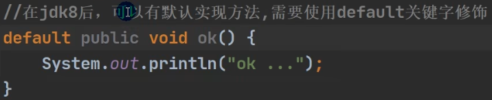


应用场景：


命名无法统一    =>     接口    =>    统一名字

### 注意事项

接口不能被实例化

接口中所有方法都是public方法，如果是抽象方法，可以不用加abstract修饰

**一个普通类实现接口，必须实现接口的所有抽象方法**

**抽象类实现接口，可以不用实现接口的方法**

​								**快捷键alt + enter快速实现重写接口方法**


**一个类可以同时实现多个接口**

**==接口中的属性，是public static final的==**  


**一个接口不能继承其他类，但是可以继承多个别的接口**  

​	`interface A extends B,C{}`

**接口的修饰符只能是public或默认**，这点**和类的修饰符一样**

### 实现接口 vs 继承类

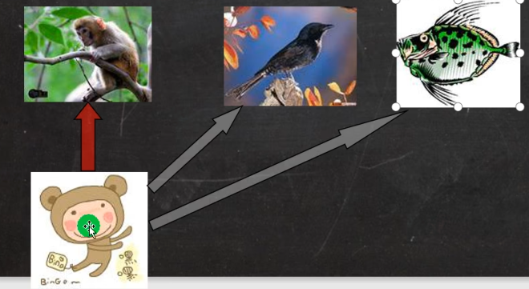

小猴子继承老猴子，但是要想实现小鸟，鱼的话就要用接口实现


**子类继承父类，就自动拥有父类的功能，如果子类要扩展功能，用实现接口的方式扩展**

继承的价值在于  解决代码的复用性和可维护性

接口的价值在于  设计好各种方法，让其他类去实现这些方法

### 接口的多态

#### 多态参数


#### 多态数组


#### 接口的多态传递

**接口类型的变量可以指向实现该接口的类的对象实例**


## 内部类


==**匿名内部类很重要！**==

### 局部内部类

可以访问外部类的所有成员，**包括private**


**局部内部类不能加修饰符，但可以用final**

内部类访问外部类 直接访问，而**外部类访问内部类，要创建对象再访问**

```java
class Test{
    
    Test test = new Test();
    test.f1();
}
```

如果外部类和局部内部类的成员重名时，默认遵循就近原则，如果想访问外部类的成员，则可以使用（**外部类名.this.成员**）去访问

```java
class Fa{
    private int n1 = 10;
    public void f1(){
        class Son{
            private int n1 = 80;
            public void f2(){
                sout(n1);  //80
            	sout(Fa.this.n1) //10
            }
    	}
    }
}
```

**外部类名.this  本质就是外部类的对象，哪个对象调用f1，那么外部类名.this就指向哪个对象，如果不加外部类名，直接this.成员，那么就指向内部类**

### **（！！非常重要！！）匿名内部类**

**定义在外部类的局部位置，比如方法中**，**且没有类名**，同时还**是一个对象**

==**放在方法中！！！**==

语法：				new 类或接口（参数列表）{

​									类体

​							}


tiger的编译类型 => IA  			运行类型  =>  匿名内部类


基于类的匿名内部类也是一样


还能这么直接调用（本质是个对象）


### 应用：

当作实参直接传递，简洁高效


### 成员内部类

嵌套class


可以直接访问外部类所有属性，**包括私有的**

可以加任何修饰符（本质是成员）

成员内部类访问外部类  =>  直接访问        而  

外部类访问成员内部类  =>  创建对象再访问

外部其他类访问成员内部类：


方法一


方法三


方法二其实就是方法一


如果外部类和内部类的成员重名时，默认遵循就近原则，如果想访问外部类的成员，则可以使用（**外部类名.this.成员**）去访问

### 静态内部类

定义在外部类的成员位置，并且有**static修饰**

可以直接访问外部类 的**所有静态成员**，**包含私有的**，但**不能访问非静态成员**

可以添加任意修饰符

如果外部类和内部类的成员重名时，默认遵循就近原则，如果想访问外部类的成员，则可以使用（**==外部类名.成员==**）去访问

## 类的五大成员

属性，方法，构造器，代码块，内部类

# 第十一章 枚举 注解

## 自定义类实现枚举


步骤：

1.构造器私有化，防止直接new

2.去掉setter，防止修改

3.类内部直接创建固定对象


4.优化  加final，防止类加载


## enum关键字实现枚举


使用enum 替代 class，**用逗号间隔**


==**常量对象写在最前面！！！**==


enum默认继承Enum类，且都是public static final

**如果使用无参构造器创建常量对象，可以这么简化(省去参数列表和小括号)**

```java
enum Season{
    SPRING,
    SUMMER,
    AUTUMN,
    WINTER;
    private Season(){}
}
```

### 常用方法


valueOf:


```java
Season autumn = Season.SPRING;
sout(autumn.name());  //out:SPRING
sout(autumn.ordinal()); //out:2     
sout(autumb.values());  //values返回值是个数组
Season autumn1 = Season.valueOf("AUTUMN");
sout(autumn1);  
sout(Season.AUTUMN.compareTo(Season.SUMMER)); //out:1,将前面的编号-后面的编号
```

values方法返回的数组：


autumn1:


**enum不能继承其他类，但可以实现接口**

enum 类名 implements 接口1, 接口2{}

## JDK内置的基本注解类型


## 元注解：对注解进行注解


# 第十二章 异常

## 概念

快捷键： ctrl+alt+t


## **体系图**


## 常见异常

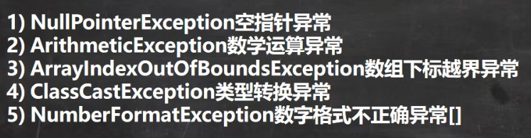

1.

4.

5.

## 异常处理分类


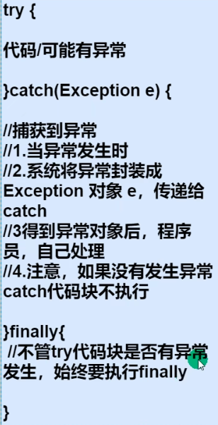**所以通常将释放资源放在finally中**


一旦发生异常，try中剩下代码就不执行了


**对一段代码（可能有多个异常）用不同的catch处理不同异常**

**要求：子类异常写前面，父类异常写后面**


### throws


**抛出异常，让调用f1方法的调用者（方法）处理**

或者这么写也可以


运行异常程序中如果没有处理那么默认throws出去

#### throws父子类异常


**子类异常必须为父类异常子类型或相同类型**

#### 同类中调用其他方法throws出的==编译==异常


此时编译无法通过，需要在f1方法也进行异常处理

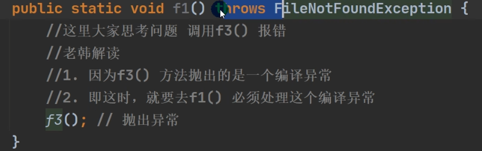

或者


**特别注意，如果方法抛出的是运行异常，则不需要如此处理**


## 自定义异常

**自定义异常类名，继承Exception(编译异常)或RunTimeException(运行异常)**


**一般我们都继承RunTimeException**

### 例题：


**finally优先于throw return等**

## throw和throws的对比


# 第十三章 常用类

## 包装类 Wrapper

.

黄色的都对应如下图


### 包装类和基本数据类型的转换

例：int <=> Integer


#### int => Integer  (JDK5以后，底层使用valueOf方法)

```java
int i = 10;
Integer m = i;
```

#### Integer => int   (JDK5以后，底层使用intValue方法)  

```java
Integer n = new Integer(99);
int n2 = n;
```


#### 例题：

#### **三元运算符要看做一个整体**

精度最高的是Double 所以结果是1.0


### 包装类型和String类型的转换


​									Integer j3 = Integer.parseInt(s3);

### Integer类和Character类的常用方法


### Integer类例题


==**只要有基本数据类型，判断的就是值是否相等**==


## String

### String结构及原理（内存分布图）


串行化：可以在网络上传输


#### 例题1：


**intern指向常量池，返回池的地址**


#### 例题2：


#### 例题3：


#### 例题4：

**c指向堆中的value数组**


#### 例题5：


**特别注意：final不能修改char数组的地址，而非内容**

#### **方法会新开一个栈**

new String("hsp") 指的堆中的value，是final的，只能重新在池中开一个Java，并指向它


### String类的常见方法

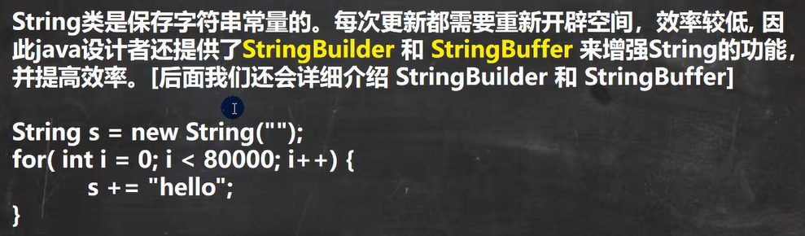


**不能用str[0]来获取字符，用charAt来取**


#### concat


**replace不会影响原字符串，返回拷贝**

#### split


#### compareTo

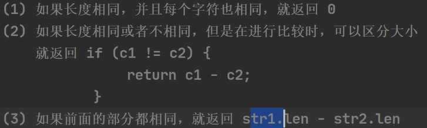

#### format


## StringBuffer


**特别注意：value数组不是final，所以存放在堆中**

#### String vs StringBuffer


#### 构造器


### 常用方法


**删改都是左闭右开区间**


如果append null，将null转成字符串null


如果new一个null的StringBuffer，那么会抛异常


## StringBuilder


**只能用于单线程！**


**单线程下使用，无线程安全，存放堆中**

#### String StringBulider StringBuffer的比较


**如果对String做大量修改，不要用String！**

## Math


**Math.random() 返回[0, 1) 的随机数**

## Date、Calendar、LocalDate


### 第一代日期类 Date


最后两行，将格式化的日期字符串转成Date

### 第二代日期类 Calendar


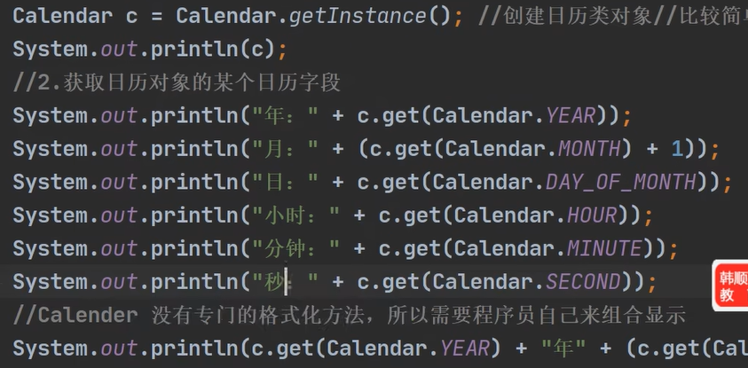

**不能new！只能用getInstance**

如果要改成24小时，要这么改 

### 第三代日期类

**LocalDate、LocalTime、LocalDateTime （JDK8加入）**


**同样不能用new**


#### DateTimeFormatter格式日期


#### Instant 时间戳

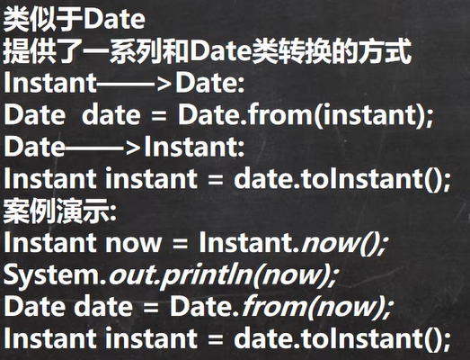

## System

### 常见方法


**一般是 System.exit(0)   0表示返回的状态**

#### arraycopy

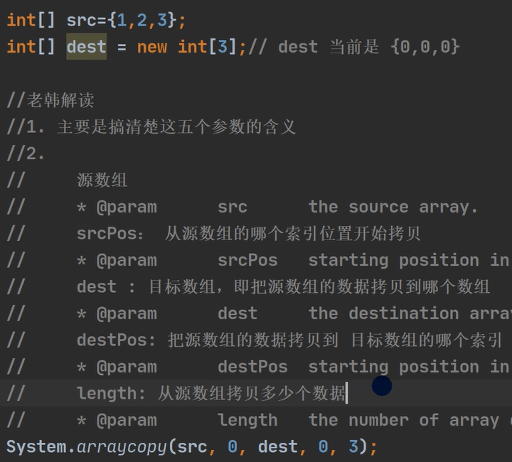

## Arrays


### toString


```java
sout(Arrays.toString(integers)); //out: [1, 20, 90]
```

### sort


### binarySearch

要求数组有序，如果不存在该元素返回-1，如果没找到，返回

**-（应该在的位置+1）**

### copyOf


如果超出，则用null占位

### fill


### asList


## BigInteger、BigDecimal


**BigDecimal 的 divide可能会抛出异常（当除不尽陷入无限循环时）**


解决办法：指定精度即可  加上BigDecimal.ROUND_CEILING


# 第十四章 集合

## 集合框架体系


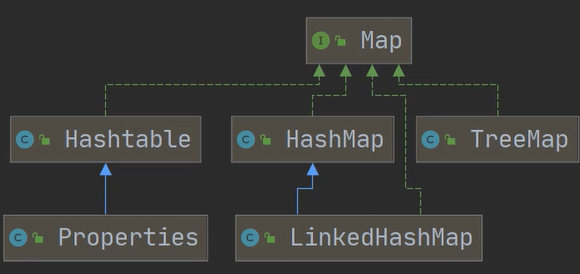

**集合主要分为单列集合（Collection）和双列集合(Map)**

## Collection


### List

**List都是有序的，可重复**

#### 接口方法

**add**，addAll同理


indexOf lastIndexOf remove set **subList(返回子集合，左闭右开)**


#### 遍历：

##### **iterator迭代器**


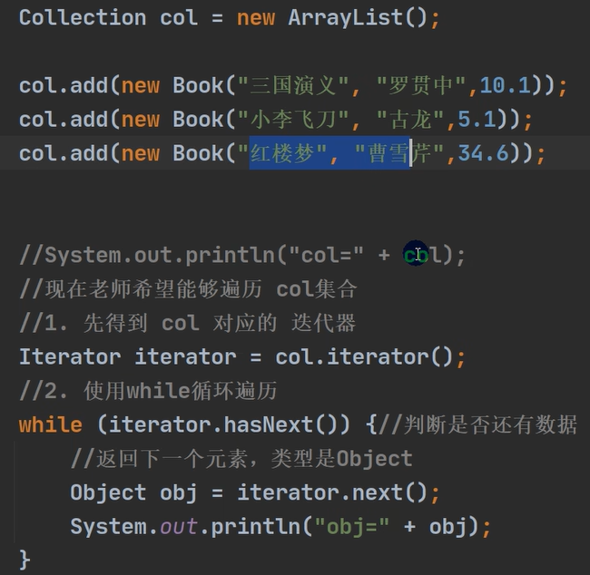

快捷键：**itit**补全

当退出while循环后，迭代器指向最后的元素，再调用next会报错

如果想再次遍历，要重置迭代器 **`iterator = col.iterator();`**

##### **增强for循环遍历**   **快捷键  I 大写的i补全**


##### 普通for + get()

**get可以获取对应位置的某个元素  `sout(list.get(4));`**

#### ArrayList

**添加的元素本质是Object而不是基本数据类型了**

```java
List list = new ArrayList();
list.add("jack");
list.add(10);
list.add(true);
sout(list); //out:[jack, 10, true]
list.remove(0);  //out: [10, true];
lsit.remove("jack");
sout(list.contains("jack"));
sout(list.size()); //out:2
sout(lsit.isEmpty());
list.clear(); 
ArrayList list2 = new ArrayList();
list2.add("1313");
list2.add("adad");
list.addAll(list2);  //添加多个元素
list.containsAll(list2);
removeAll(list2);
```


##### 注意事项

可以放null，ArrayList基本等同于Vector，**ArrayList是线程不安全的，但效率高**

在多线程情况下，不建议使用ArrayList

##### 扩容机制


**transient  表示该属性不会被序列化**

#### LinkedList


##### 底层


##### LinkedList增删改查


#### Vector


##### 和ArrayList比较


### Set


**特别注意：不能用索引方式遍历**


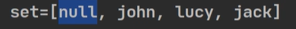

**添加数据顺序和结果数据顺序不一定一样**

#### HashSet

实际上是HashMap


###### 例题：


HashMap**底层是数据+链表+红黑树**

##### **（！！非常重要！！）HashSet底层**


**即底层先调用hashCode()方法进行比较，如果该位置没元素，放进去，有元素，要用equals循环判断，如果相等，则不添加，不相等，加入链表尾部**

##### 重写底层比较方法


#### LinkedHashSet

是HashSet的子类，底层是LinkedHashMap，维护了一个数组+双向链表


**保证有序，也可重写equals和hashCode方法来判断是否重复**

#### TreeSet

**可以排序，底层还是TreeMap**

```java
TreeSet treeset = new TreeSet();
treeset.add("lanson");
```


**可以用匿名内部类重写排序**


如果两个字符串相等，就不会加入treeset中，

同理，如果比较两个字符串长度，如果两个字符串长度一样，也不会加入进去

## Map


特别注意：这里**是 put 而不是 add，无序！**

**当有相同的key时，相当于替换**

**map.get(key)  传入key，返回对应的value**

### 底层：


一对 key value 放在HashMap的Node里，而后面的Set是引用，指向Node中的key，Collection也是引用，指向Node中的value


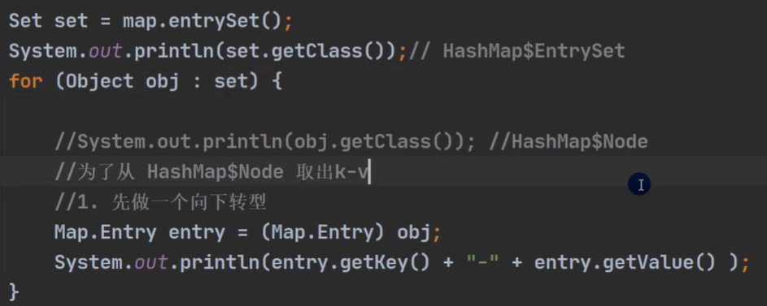

**单独获取key集合或value集合**


### map常用方法


### 遍历方法


### 底层


**每个键值对都是一个HashMapNode，而HMN又实现了MapEntry这个接口**

**扩容机制和HashSet一模一样**

### HashMap

没有实现同步，线程不安全

### Hashtable

**键值对都不能是null**

**线程安全**

### LinkedHashMap

### TreeMap


**和TreeSet同理，只不过按key顺序排序**

### Properties


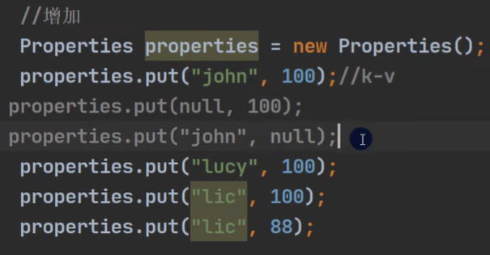

**键值都不可以为空**

```java
sout(properties.get("lic")); //out:88
sout(properties.put("lic", 150));
```

## 如何选择集合实现类？


## Collections工具类


### copy注意事项

**不能直接`Collections.copy(dest, list);`，会抛异常**

**原因：要保证list的长度小于等于dest的长度**

所以先将dest赋初值


# 第十五章 泛型

**使用泛型，放入和取出时不需要类型转换，提高效率**

## 语法

特别注意：**这里的E只能是引用类型，不能是基本数据类型**


E可以是String Integer Double等等


### 简写


如果不加泛型，默认加\<Object>


### entrySet迭代器遍历

**不需要向下转型了**


## 自定义泛型


### 注意事项

**普通成员可以使用泛型（属性，方法）**

**使用泛型的数组不能初始化**


**静态方法中不能使用类的泛型**


**因为在类加载时，对象还没创建**

**泛型类的类型是在创建对象时确定的**

如果在创建对象时，没有指定类型，默认为Object


### 自定义泛型接口

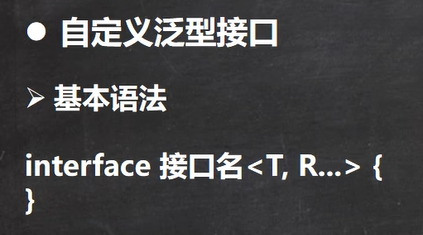

**静态成员也不可以使用泛型，接口类型在继承接口或实现接口时确定**


**接口成员都是final static的，所以会报错**


**alt+enter快速生成**


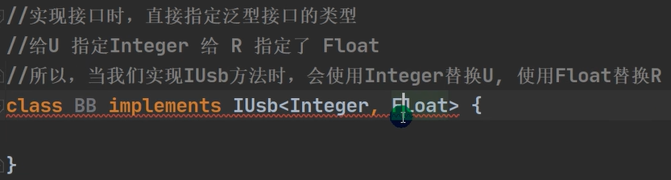

### 自定义泛型方法


#### 注意事项

**泛型方法可以定义在普通类中，也可以定义在泛型类中**


**当泛型方法被调用时，类型会被确定**


**public void eat(E e){} 修饰符后没有<T, R...> eat方法不是泛型方法，只是使用了泛型**

**泛型方法可以使用类声明的泛型，也可以使用自己声明的泛型**


## 泛型继承和通配符

**泛型不具备继承性**

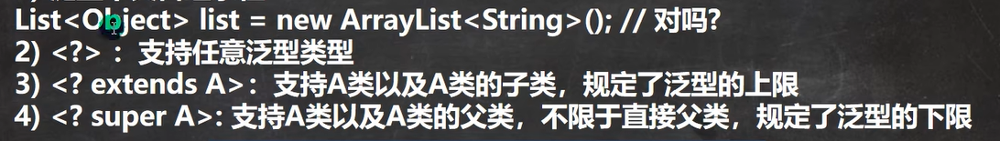


# 第十六章 坦克大战

## java绘图坐标体系

## java绘图技术

## java事件处理机制

