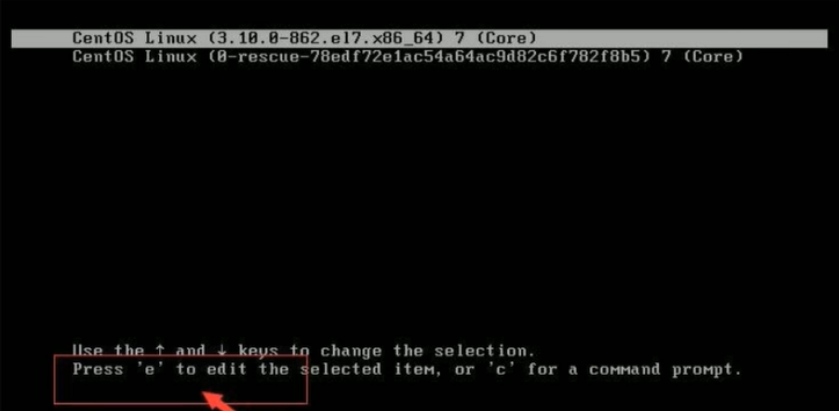
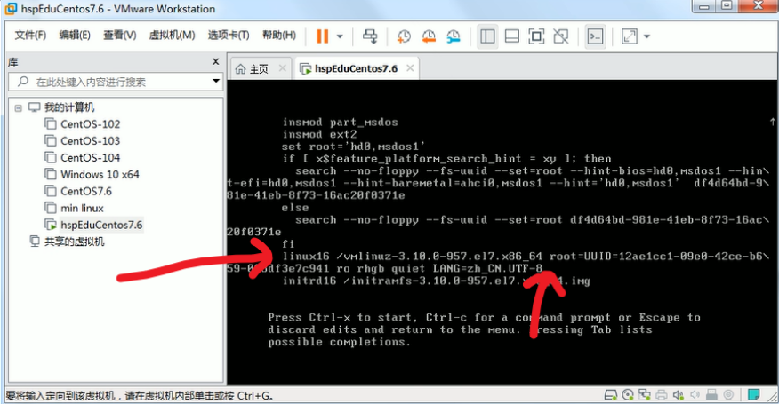

# 找回root密码

2.找到Linux16开头的所在行数，并将光标移到这行最后（UTF-8后）

输入  **init=/bin/sh**

然后==**不要按回车！！！**==   **按ctrl+x**

接着输入  mount -o remount,rw /

在新的一行后面输入passwd

再输入 touch /.autorelabel

继续输入 exec /sbin/init

等待系统自动修改密码，等待时间比较长，耐心等待，不要重启