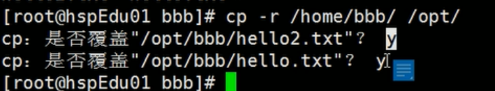
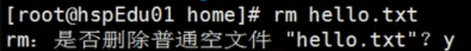
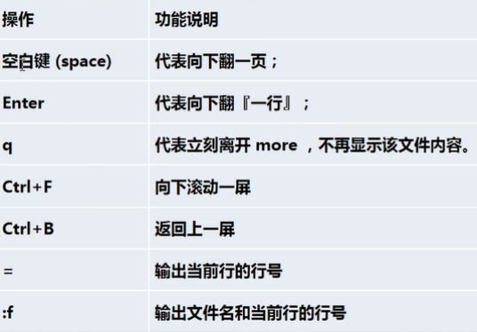
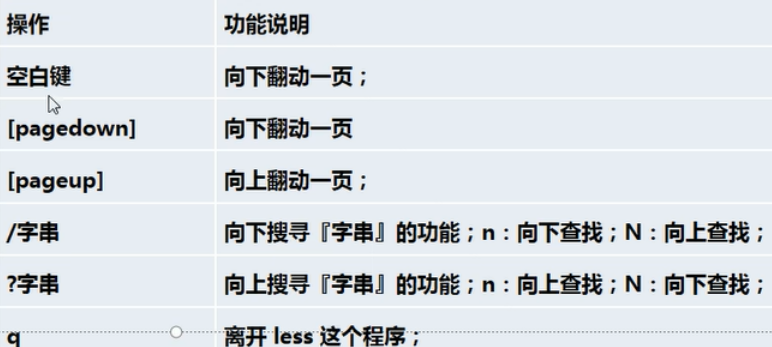
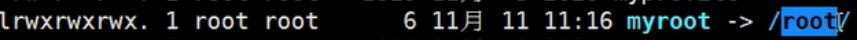

# 文件目录类

### cd指令

**cd ~**  或 cd 回到自己的**家目录** 如 cd ~ 回到/root

### 回到上上级下的另一文件夹

**cd ../../root**

### mkdir指令

**mkdir -p 路径名**    :创建多级目录  例如  mkdir -p /home/lanson/demo/demo2

### rmdir指令

rmdir**无法删除非空目录**

## 要想删除非空目录，需用 **rm -rf**  ==小心谨慎==！

### **touch** 创建空文件

### cp  指令

**cp [选项] source dest**		常用选项：**-r:递归复制整个文件夹**

```shell
假设/demo下有许多文件
cp -r /home/lanson/demo/ /opt
```



**重复复制会提示是否覆盖**

强制覆盖不提示：  \cp -r /home/lanson/demo/ /opt

### rm指令

**rm [选项] 要删除的文件或==目录==**



**-f 无提示直接删除   -r:递归复制整个文件夹**

### mv 指令

**mv oldFileName newFileName**  重命名

**mv /temp/movefile /targetFolder**  移动文件

### cat 指令

**cat** 查看文件内容（只读不可改）

常用选项： **-n**  查看行号

**cat -n /home/lanson/demo/demo.cpp**

细节： 为了浏览方便，一般会带上  ==**管道命令 |more**==

**管道命令**：把前面处理的结果交给下一个程序处理

**cat -n /etc/profile | more**    		空格翻页，回车显示下一行

### more 指令

more 是一个基于VI的文本过滤器，设置了若干快捷键



**more /etc/profile**

### less 指令

分屏查看文件内容，和more类似，但更强大，支持各种显示终端

显示时，并非一次将整个文件加载之后才显示，而是**根据显示需要，加载内容**，对于显示大型文件具有较高的效率

假设文件100M，more全部加载后才显示，较慢，less则是先加载一部分后立刻显示，接着根据需要继续加载



### echo 指令

输出内容到控制台

echo [选项] [输出内容]

案例：输出环境变量(**==环境变量前要加\$==**)  $PATH \$HOSTNAME,	

**echo \$PATH**

**echo "HelloWorld"**

### head 指令

用于显示文件的开头部分内容，**默认显示文件前10行**

**head -n 5 文件**	只查看前5行

### tail 指令

与head相反

==**tail -f 文件  	实时追踪该文档的所有更新**==

### **\>   重定向（覆写）和 \>>   追加 指令**


**echo "Hello" > /temp/demo.txt**      **覆写**

**echo "Hello" >> /temp/demo.txt**    **追加**

**ls -l > 文件**		将列表的内容覆写到文件中

**ls -al >> 文件	**	将列表的内容追加到文件中

**cat 文件1 > 文件2**		将文本1的内容覆写到文件2中

**echo "内容" >> 文件**

**ctrl + C / ctrl + Z 退出**

### ln 指令

软链接 也叫 符号链接  类似于快捷方式，存放了链接其他文件的路径

**ln  -s  源文件或目录   软链接名**  	给文件创建一个软链接

**ln  -s  /root   /home/myroot**	

在home下  cd  myroot/	就会切换到 /root 目录  

**删除软链接	**		和文件一样，**rm /home/myroot**

特别注意，**==myroot 后不要加 /==** ，否则会报错：myroot不是一个目录

==**在后面加 / 就是目录，不加 / 就是文件**==

### history 指令

查看历史命令

查看最近10个指令  history 10

**执行历史编号为5的指令   !5**