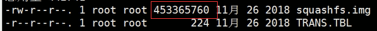
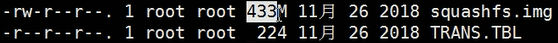
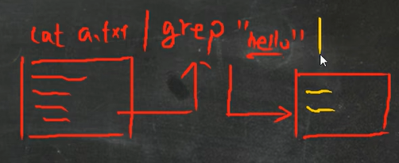
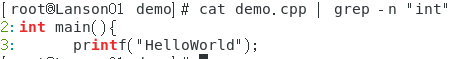

# 搜索查找类

### find 指令

将从指定目录向下递归地遍历其各个子目录，将满足条件地文件或目录显示在终端

**find  搜索范围  选项**

选项：  

**-name  文件名**	  按文件名查找文件

**-user  用户名**        查找属于指定用户名的所有文件

**-size  文件大小**	 **（+n 大于 -n 小于 n 等于）**   按指定的文件大小查找文件

**find  /  -size  +200M**	找根目录下大于200M的文件

#### 查看大文件所在目录方式：	

**ls  -l**  将会以字节显示

**ls  -lh**  将以更高的可读性显示

### locate 指令

locate 可以快速定位文件路径  locate 不会遍历整个文件系统，查询速度较快，会自行建立数据库

**第一次使用时需要用 updatedb 指令创建locate 数据库**

每次创建新文件时，**若要查找该新文件的路径**，**需要 updatedb**

**locate  文件名**		**无需加搜索范围**

### which指令

可以查看某个指令存放在哪个目录下，比如  ls  指令在哪个目录

**which ls**

### grep 指令

**grep 过滤查找**，管道符 "|" ，表示将前一个命令处理结果传递给后面的命令处理

grep  选项  查找内容  源文件

选项  

**-n**   显示匹配行及行号

**-i**    忽略字母大小写

**-v**   反选

**^xxx** 	以xxx开头的行

**xxx$**     以xxx结尾的行

`grep "^hello" demo.txt `

`grep "world$" demo.txt`

或  grep  -n  "int"  /home/lanson/demo/demo.cpp