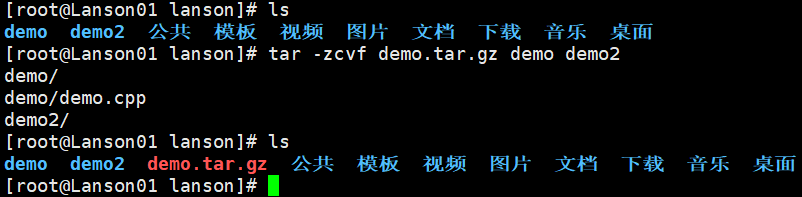
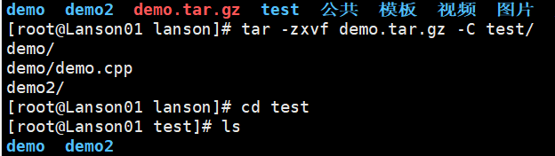

# 压缩和解压类

### gzip/gunzip  指令

**gzip** **只能用于**压缩文件  **gunzip** 用于**解压**

**gzip  文件名**			压缩文件，只能将文件压缩为 *.gz 文件

**gunzip  文件名.gz**		解压缩

### zip/unzip 指令

**zip** 用于压缩文件 / **目录**

zip/unzip  选项  xxx.zip

**zip**  常用选项:  **-r**  压缩文件名	递归压缩，即**压缩目录**

```shell
zip  -r  myhome.zip  /home/
```

会将home下的所有文件及文件夹  ==**包括 home 本身**==  一起压缩

unzip  常用选项  **-d  目录名**  指定解压后文件的**存放目录**	如果不加-d 默认当前目录

```shell
unzip  -d  /home/lanson  /home/demo.zip
```

### tar 指令

**tar 既可以压缩也可以解压**		**无 untar 指令**

最后打包的文件是.tar.gz

**tar  选项  XXX.tar.gz  打包的内容** 	可文件可文件夹

**-c	 **产生.tar打包文件****

**-v**	显示详细信息

**-f**	 指定压缩后的文件名

**-z**	 打包同时压缩

**-x	** 解包.tar文件



**一般打包用 -zcvf   解包用 -zxvf**   

#### 解包到指定目录

**tar  -zxvf  XXX.tar.gz  -C  目录**

```shell
tar -zxvf demo.tar.gz -C /home/lanson
```


