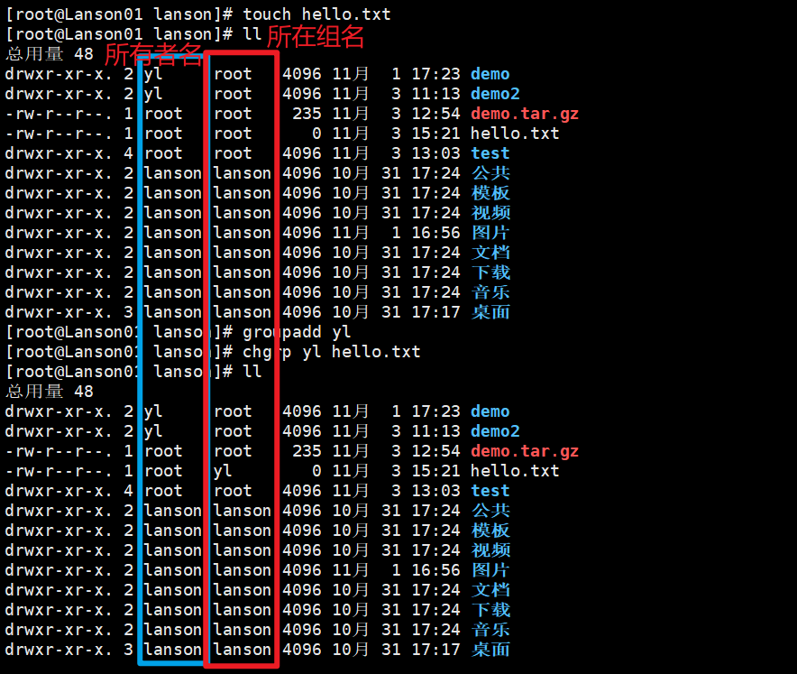

# 组与所有者

**所有者**  	  文件创建者（可改）

**所在组**		文件创建者所在的组

**其他组**		文件创建者所不在的组

**改变用户所在的组**

## 所有者

**查看文件所有者**

**ls -ahl**

**修改文件所有者**

**chown  用户名  文件名**

### 组的创建

**groupadd monster	**	创建monster组

**useradd -g monster lanson2**		创建lanson2用户并把他扔进monster组

### 修改文件所在的组

**chgrp 组名 文件名**



### 改变用户所在组

**usermod  -g  新组名  用户名**

**usermod  -d  目录名  用户名**		改变该用户登录的初始目录==（用户需要有进入到新目录的权限）==

### 查找是否存在组

```shell
cat /etc/group | grep zu'ming
```

