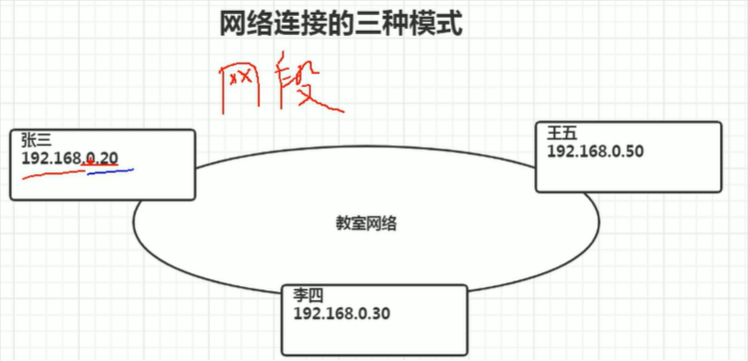
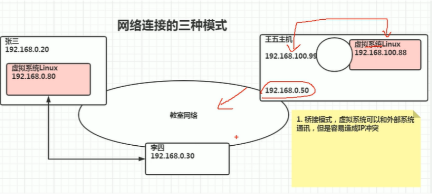
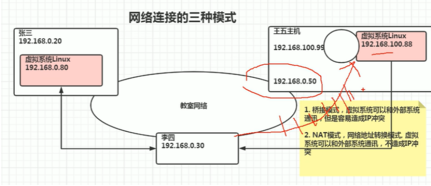

# 三种网络连接方式

### 网段

**前3个数（192.168.0）相同，则为同一网段下，即可相互通讯**

**桥接模式：虚拟系统可以和外部系统通讯，但容易造成IP冲突**

NAT模式：

1923168.100.99 和 192.168.100.88 相互独立且可以通讯

虚拟系统linux 可以通过192.168.0.50 代理，可访问教室网络

NAT模式：网络地址转换模式，虚拟系统可以和外部系统通讯，不造成IP冲突

**虚拟Linux 可以访问外部，但外部不能直接访问虚拟Linux**

主机模式：独立的系统