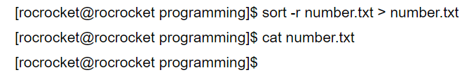

# cut tee sort tr

## cut

获取每一行第n个字符

cut -c 5	获取每行第5个字符

## tee

t e e，一入二出，表明不仅写入文件，同时也在控制台进行输出

一般配合管道命令进行输出

**tee filename**		默认覆写

**tee -a filename**	追加

**ls -l | tee demo2.txt | wc -l**

写入文件并显示字数行数

## sort

**sort [参数] [filename]**

**-u**	去除重复行

**-r**	 默认升序，改降序

**-o**	

由于sort默认是把结果输出到标准输出，所以需要用重定向才能将结果写入文件，形如sort filename > newfile。

但是，如果你想把排序结果输出到原文件中，用重定向可就不行了。

看，竟然将number清空了。

就在这个时候，-o选项出现了，它成功的解决了这个问题，让你放心的将结果写入原文件。这或许也是-o比重定向的唯一优势所在。

**-n**	

若不加，会出现10比2小的情况，由于排序程序将这些数字按字符来排序了，排序程序会先比较1和2，显然1小，所以就将10放在2前面。

使用-n选项，来告诉sort，要以数值来排序！

**-k**

第几列进行排序，如-k 4 就以第4列的值进行排序

## tr

**替换/删除**

**tr [参数] "sourceString" "targetString" <inputFileName**

**或配合管道命令   cat filename | tr  [参数]  "sourceStirng" "targetString"** 

`cat file | tr [a-z] [A-Z] > new_file`  小写改大写

` cat file | tr -d "Lanson" > new_file`	

删除文本中所有L、a、n、s、o、n  字母，**而非Lanson字符串**

` cat file | tr "abc" "xyz" > new_file`

**将文本中 a变x，b变y,  c变z**，而非 abc字符串变xyz

` cat file | tr -s [a-zA-Z] > new_file`

删除“连续着的”重复字母，只保留第一个

` tr "hello" "world" <stat.txt >stat.tmp`

将 stat.txt 中 h e l l o 替换为 w o r l d ，并写入 stat.tmp 文