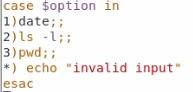
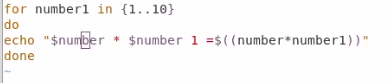
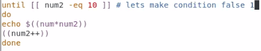
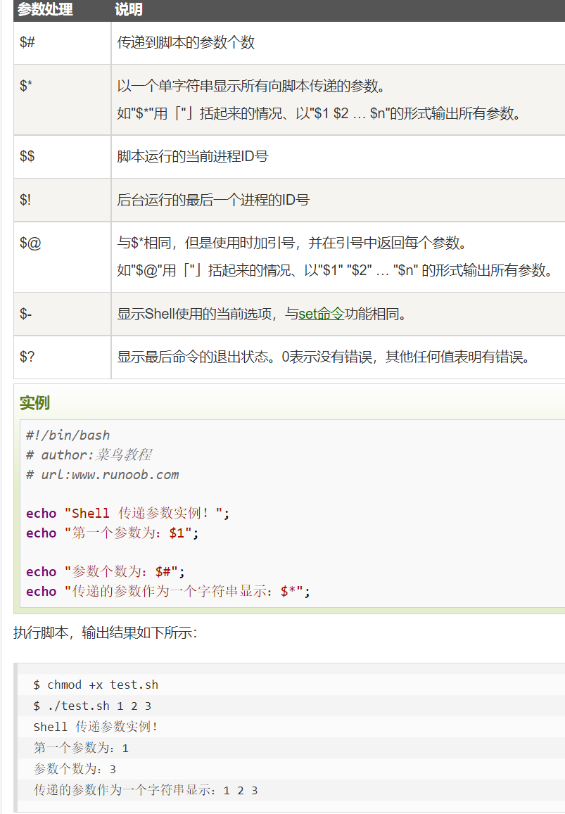
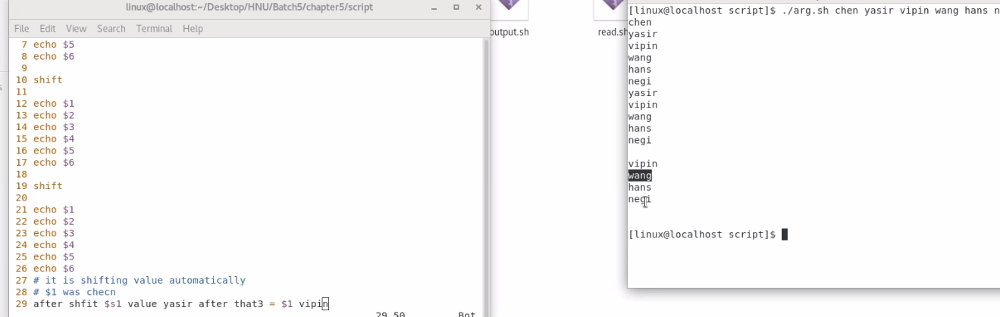

# 脚本shell

**echo 效果等于 printf**

**打开脚本(在文件夹下使用相对路径) 	./scriptname**

**新建脚本  vim scriptname**

**\#  注释**

`read county`

**必须以 ==#!== 开头**  后一般接 /bin/bash

```shell
#!/bin/bash
echo type your name
read country
echo my country name is &country
```

**在脚本外定义变量**

**export** 变量名=值


-eq 等于

-gt  大于

-ge 大等

-lt   小于

-le  小等

# if


else 改成 then

# case



*: 其他输入

# for



# until



# arguments 传参



# shift

**类似不断pop_front（）的vector**



