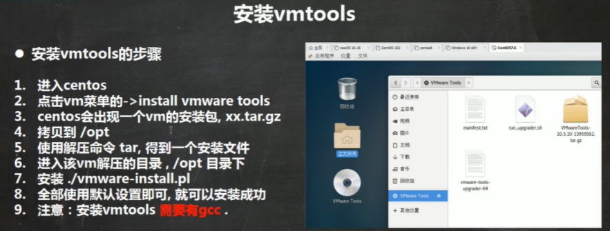

# 安装vmtools

更好地管理vmware，可以设置windows和centos的共享文件夹

### cd /路径名   `cd /opt`  进入opt目录

**进入某路径**

### tar -zxvf 文件名（进入路径后按Tab即可补全）

**解压**

### 安装  ./文件名

`./vmware.......` 安装文件

### 与主机共享文件夹

Linux上的路径为 **mmt/hgfs**