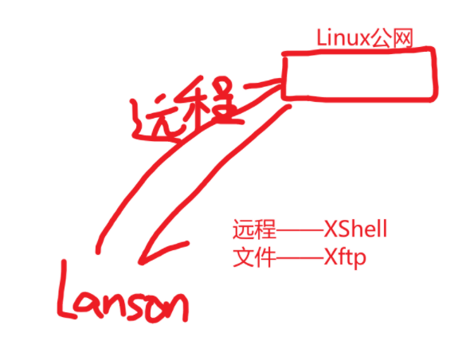
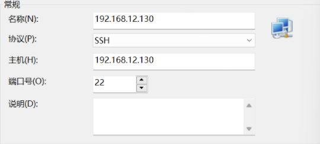

# 远程登录Linux

Linux服务器是开发小组共享

正式上线的项目是运行在公网

程序员需要远程登录到Linux进行项目管理或开发

画出简单的网络拓扑图

### 查询IP地址  ifconfig

### 配置XShell

XShell**只能**对Linux 公网进行远程命令操作，**文件上传下载无法做到**

### reboot

用户Lanson 将 reboot 指令发送到远程Linux服务器，Linux执行reboot，使Linux重启