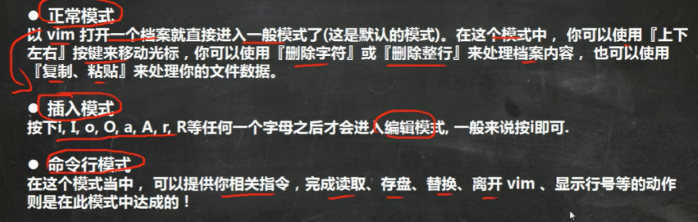

# Vi 和 Vim

**Linux系统会内置 Vi 文本编辑器 ** (类似于txt)

Vim —— Vi 增强版   字体颜色，代码补全等

## 三种常用模式

#### 正常模式   

只能上下左右移动光标，不能输入不能编辑

#### 插入模式  

一般**输入i**进入插入模式（编辑模式）

写完代码后要**从插入模式切换到命令行模式才能保存**

从插入模式切换到命令行模式： ==**先按ESC   再输入冒号 ： 再输入wq**==

wq : write and quit

#### 命令行模式

如果还想继续修改文件，则输入**vim 文件名** 即可