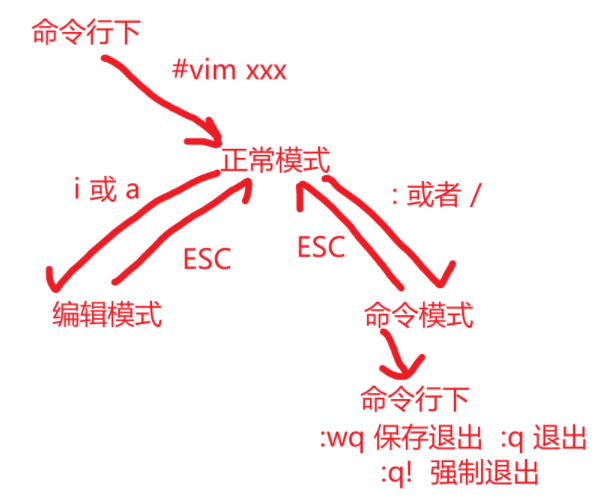
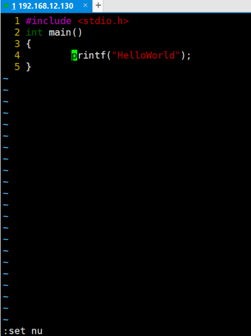

# 各种模式的相互切换及Vim快捷键

### 各种模式的相互切换

### Vim 中的快捷键

1. 拷贝当前行 yy    ==注意，要在一般模式下输入yy==， 拷贝当前行向下的5行 5yy， 并 ==输入p粘贴==

2. 删除当前行 dd， 删除当前行向下的5行 5dd

3. 在文件中查找某个单词 [**正常模式下  /关键字 ** ，回车 查找， 输入n就是查找下一个]

4. 设置/取消 文件的行号 [命令行下 :set nu 和 :set nonu]

   

5. 编辑 /etc/profile 文件，**一般模式下**使用快捷键到该文档的最末行[G]和最首行[gg]

6. **撤销  u**

7. 编辑 /etc/profile 文件，**在一般模式下**并将光标移动到第 20行  shifft+g

​       在**一般模式下输入20，再按shift+g即可**

### set命令

**:set ic**  忽略大小写

**:set number  /  :set nu**		   设置行号

**:set nonumber  /  :set nonu**	  取消行号

**:set hlsearch**		  设置搜索高亮

**:set nohlsearch**	 取消搜索高亮

**:set magic**			  搜索特殊字符

### map命令

**map可以将键盘按键映射**

如 **:map x 3yy**  **命令模式下**  按下 x 键时，即等同于输入3yy

**:map o :wq\<enter>**

### ab命令

**:ab sn set nu**

**:iab sn set nu**

