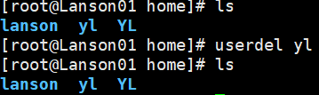
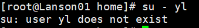
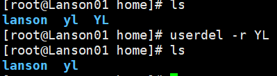
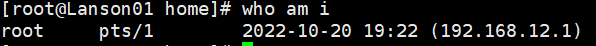
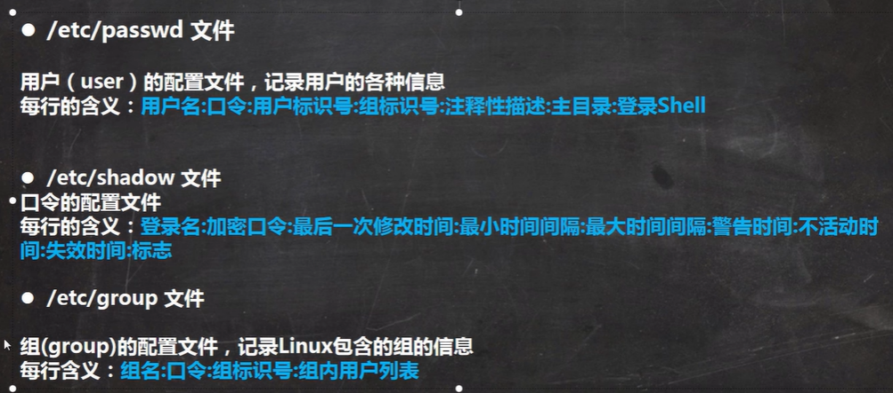

# 用户管理

Linux是一个**多用户多任务的操作系统**，任何一个要使用系统资源的用户，都必须首**先向系统管理员申请一个账户**，再进入系统

### 添加用户

useradd 用户名

例如 添加一个用户 YL   **默认该用户的家目录在 /home/YL**

**当用YL登录时，会默认自动切换**到/home/YL 目录下

也可以通过  useradd -d 指定目录  新的用户名       给新创建用户指定家目录

### 指定/修改密码

**passwd 用户名**  	如果不写用户名，则默认给当前登录的账户修改密码

### 显示当前所在目录

**pwd**

### 删除用户

**删除用户但保留家目录**    

**userdel  用户名**       	userdel SB

**删除用户及家目录**

**userdel -r 用户名**    		userdel -r YL

==**一般保留家目录**==

### 查询用户信息

**id  用户名**

### 切换用户

**su - 切换用户名**

==注意：从权限高的用户切换到权限低的用户，**不用输入密码，反之则需要**==

要返回原用户时只需logout即可

### 查看当前用户/登录用户

**who am i**

who am i 显示的是**第一次登录的用户**，比如root -> Lanson -> YL

在YL用户下输入who am i，**显示的是root**

### 用户组

系统可以对**有共性**/权限的多个用户进行**统一的管理**

### 新增组

**groupadd 组名**

### 删除组

**groupdel  组名**

### 增加用户时直接把他加到组里

**useradd -g 用户组 用户名**

如果在用户名前**不加**用户组名，则会自动创建一个**同名的用户组**

### 修改用户所在的组

**usermod -g 用户组 用户名**

**Shell —— 命令解释器**  

### 查看所有用户组

**vim /etc/group**     	退出：  	:q!

### 将用户移出用户组

**gpasswd -g 用户名  组名**

