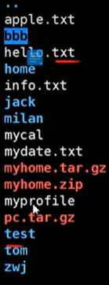

**processor** 处理器

1st, **GUI**(graphical user interface)图形用户界面

2nd, **CLI**(command line interface)命令行界面

**execute** 执行

**kernel** 内核

GNU Project

time-sharing: sharing computing resource among many user at the same time(多人协作)

RAM:内存

**蓝色是目录，白色是文件**

:5,10w >> demo.txt

向demo.txt中复制该文件的5-10行
