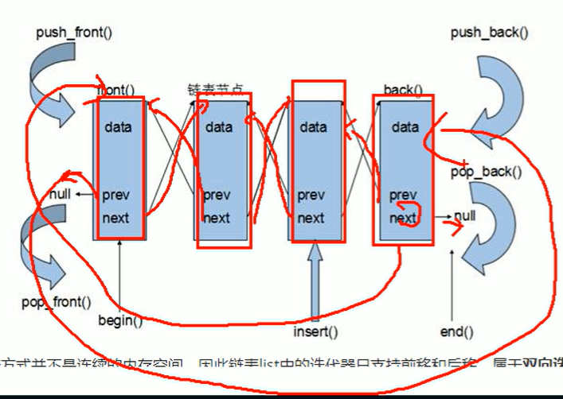

# list容器

## 将数据进行链式存储

链表  是一种物理存储单元上非连续的存储结构，数据元素的逻辑顺序是通过链表中的指针链接实现的

**链表  由一系列结点构成**

**结点的组成**： 一个是存储数据元素的**数据域**，另一个是存储下一个节点地址的**指针域**


**指针域**：**指向下一个结点的地址**

优点：**可以对任意位置进行快插和快删元素**

缺点：**容器遍历速度没有数组快**、**占用空间比数组大**

如果是数组，在中间插入元素需要将数据整体进行移动，而结点不需要移动，只需要修改两个结点的指针域即可


STL中的链表是一个**双向循环链表**



**双向：每个结点存放两个指针**，一个指向前一个结点，另一个指向后一个结点

循环：最后一个结点的下一个指针  指向  第一个结点

​			第一个结点的前一个指针     指向  最后一个结点

由于链表的存储方式并不是连续的内存空间，所以**list的迭代器只支持前移和后移，不支持随机访问，属于双向迭代器**

**list中插入和删除都不会造成原有list迭代器的失效，这在vector中是不成立的**

**list和vector是最常用的容器，各有优缺点**

## 构造函数

list\<int> l	

list(begin, end)

list(n, elem)

list(const list &l)	拷贝构造

## 赋值和交换

=

assign(begin, end)

assign(n. elem)

swap(list)

## 大小操作

size()

resize(num)

resize(num, elem)

empty()

## 插入和删除

push_back(elem)	 push_front(elem)

pop_back()	pop_front()

insert(pos, elem)	  insert(pos, n, elem)		insert(pos, begin, end)

clear()		erase(begin, end)		erase(pos)

**remove(elem) 删除容器中==所有==与elem值匹配的元素**

## 数据存取

front()	返回第一个元素

back()	返回最后一个元素

==**没有 at 和 [] **==

**链表是以结点形式存储，没有连续空间，迭代器也只能前移后移，属于双向迭代器，不支持随机访问，所以不能用 at 和 []**

**it++ 和 it = it + 1 在这里作用不同**

```c++
list<int> l;
for(list<int>::iterator it = l.begin(); it != it.end(); it++){
    cout << *it;  //正确
}
```

```c++
it++; 	//正确，迭代器后移 支持双向
it--; 	//正确，迭代器前移
it = it + 1  //错误，不支持随机访问
```

## 反转和排序

reverse()	  反转链表

sort()			链表排序

```c++
l.reverse();
```

```c++
#include <algorithm>
list<int> l;
l.sort(l.begin(), l.end());	//报错！
```

**所有==不支持随机访问迭代器的容器==，不可以用标准算法**

不支持随机访问迭代器的容器，内部会提供一些对应的算法

```c++
list<int> l;
l.sort();		//正确
```

这里的 sort 是 list 的**成员函数**，并非标准算法的全局函数

默认**升序排序**

#### 降序

```c++
bool myCpmpare(int v1, int v2){
    return v1 > v2;
}
l.sort(myCpmpare);
```

**若返回值为true,则让两个参数进行交换**

