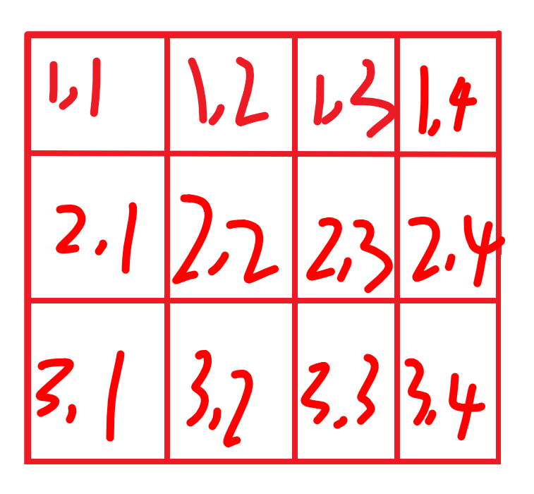

# 前缀和与差分

### 一维前缀和

```c++
int main(){
    int a[10000], S[10000];
    int n, m;
    scanf("%d %d", &n, &m);
    for(int i = 0; i < n; i++) scanf("%d", &a[i]);
    for(int i = 0; i < n; i++) S[i] = S[i - 1] + a[i];
    while(m--){
        int l, r;
    	scanf("%d %d", &l, &r);
    	printf("%d", S[r] - S[l - 1]);
    }
}
```

### 二维前缀和

**坐标看成二维数组，看成方格，而不是坐标点**



**定义 a[0] S[0] 均为0，这样就不会出现边界问题**

```c++
int main(){
    int m, n, q;
    int a[10000], S[10000];
    for(int i = 1; i <= n; i++)
        for(int j = 1; j <= m; j++)
            scanf("%d", &a[i][j]);
    for(int i = 1; i <= n; i++)
        for(int j = 1; j <= m; j++)
            S[i][j] = S[i - 1][j] + S[i][j - 1] - S[i - 1][j - 1] 			  + a[i][j];
    while(q--){
        int x1, x2, y1, y2;
        scanf("%d%d%d%d", &x1, &y1, &x2, &y2);
        printf("%d", S[x2][y2] - S[x1 - 1][y2] - S[x2][y1 - 1] + S[x1 - 1][y1 - 1]);
    }
}
```

## 差分

如上文提到的a[i] S[i]，构造一个数列b[i]，使得**b[1] + b[2] + ... + b[i] = a[i]**

**则称a[i]为b[i]的==前缀和==，b[i]为a[i]的==差分==**

#### 一维差分

```c++
int main(){
    int a[1000], S[1000];
    int m, n;
    scanf("%d%d", &m, &m);
    for(int i = 1; i <= n; i++){
        scanf("%d", &S[i]);
        a[i] = S[i] - S[i - 1];
    } 
    while(m--){
        int l, r, c;
        scanf("%d%d%d", &l, &r, &c);
        a[l] += c;
        a[r + 1] -= c;
        for(int i = 1; i <= n; i++) printf("%d", S[i - 1] + 			a[i]);
    }
    return 0;
}
```

#### 二维差分

```C++
#include <iostream>
#include <vector>
#include <ctime>
using namespace std;

int main(){
	int N = 1e6 + 1;
	int a[N][N], S[N][N];
	int m, n;
	scanf("%d%d", &n, &m);
	for(int i = 1; i <= n; i++)
		for(int j = 1; i <= m; j++){
			scanf("%d%d", &S[i][j]);
			a[i][j] = S[i][j] - S[i - 1][j] - S[i][j - 1] + S[i - 1][j - 1];
		}
	int q;
	scanf("%d", &q);
	while(q--){
		int x1, x2, y1, y2, c;
		scanf("%d%d%d%d%d", &x1, &y1, &x2, &y2, &c);
		a[x1][y1] += c;
		a[x2 + 1][y2 + 1] += c;
		a[x2 + 1][y1] -= c;
		a[x1][y2 + 1] -= c;
		for(int i = 1; i <= n; i++){
			for(int j = 1; j <= m; j++){
			S[i][j] = a[i][j] + S[i - 1][j] + S[i][j - 1] - S[i 			- 1][j - 1];
			printf("%d", S[i][j]);
			}
		}
	}
	return 0;
}
```

