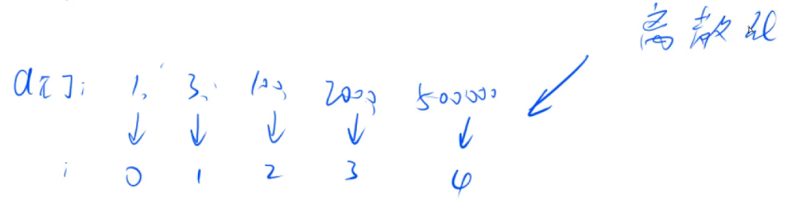

# 双指针

```c++
int n;
int a[N], s[N];
int main(){
    cin >> n;
    for(int i = 0; i < n; i++) cin >> a[i];
    int res = 0;
    for(int i = 0, j = 0; i < n; i++){
        s[a[i]]++;
        while(j <= i && s[a[i]] > 1){
            s[a[j]]--;
            j++;
        }
        res = max(res, i - j + 1);
    }
}
```

# 位运算

### n的二进制表示中第k位是几

#### 先把第k位移到最后一位  n >> k

#### 再看个位是几  x & 1

==**综合： n >> k & 1**==

## lowbit(x) :  返回x的最后一位1

**x = 1010      lowbit(x) = 10**

**x = 101000   	lowbit(x) = 1000**

二进制里， **-x是x的补码，-x = ~x（取反） + 1**


#### lowbit = x & -x

```c++
int lowbit(int x) return x & -x;
int main(){
    int x;
    cin >> x;
    int res = 0;
    while(x) x -= lowbit(x), res++;
    cout << res << ' ';
}
```

# 离散化（整数）



**映射的过程就叫==离散化==**

a[]中可能有重复元素   去重

如何算出	x	离散化后的值是多少   **（二分）**

### 去重

```c++
vector<int> alls;
alls.erase(unique(alls.begin(), alls.end()), alls.end());
```

unique:  去重，并将重复的元素移至容器最后，并返回指向第一个重复元素的迭代器		如  1 2 3 3 4 5,  unique后就是1 2 3 4 5 3, 返回 指向第5个元素即容器末尾的3 的迭代器

#### unique的实现：（源码）

```c++
vector<int>：：iterator unique(vector<int> &a){
    int j = 0;;
    for(int i = 0; i < a.size(); i++)
        if(!i || a[i] != a[i - 1])
            a[j++] = a[i];
    return a.begin() + j;
}
```

```c++
vector<int> alls;

int find(int x){
    int l = 0, r = alls.size() - 1;
    while(l < r){
        int mid = l + r >> 1;
        if(alls[mid] >= x) r = mid;
        else l = mid + 1;
    }
    return r + 1;
}


alls.push_back(); //添加数据
sort(alls.begin(), alls.end());
alls.erase(unique(alls.begin(), alls.end()), alls.end());

```

# 区间合并

