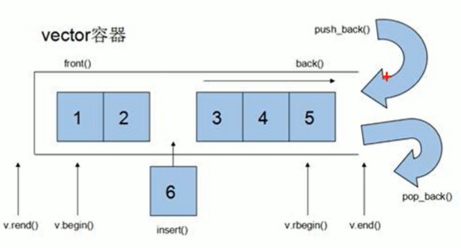

# vector容器

相似与数组，所以又被称为单端数组

**vector是动态扩展，数组是静态空间**

**动态扩展**：并不是在原空间后续接新空间，而是**找更大的空间，然后将原数据拷贝到新空间，并释放原空间**

vector容器：push_back() 添加数据，pop_back  删除数据



**vector容器的迭代器是支持随机访问的迭代器**

### vector构造函数

vector(v.begin(), v.end()) ;  //将[v.begin(),v.end())区间中的元素拷贝给本身

vector(n, elem);	//构造函数将n个elem拷贝给本身

vector(const vector &vec); 	//拷贝构造函数

```c++
void test01(){
    vector<int> v;
    for(int i = 0; i < 5; i++){
        v.push_bakc(i);
    }
    for(vector<int>::iterator it = v.begin(); it != v.end(); it++){
        cout << *it;
    }
    //利用区间形式进行构造
    vector<int> v2(v1.begin(), v1.end());
    //n个elem方式构造
    vector<int> v3(10, 100);  //构造10个100
    //拷贝构造
    vector<int> v4(v3);
}
```

### 赋值操作

assign(begin, end); 

assign(n, elem);

重载 = 号

```c++
vector<int> v1;
....赋值操作
vector<int> v2;
v2 = v1;
vetor<int> v3;
v3.assign(v1.begin(), v1.end());  //左闭右开区间
vector<int> v4;
v4.assign(10, 100);
```

==注意是左闭右开区间==

### 容量和大小

empty()  判断容器是否为空

capacity()  容器的容量  >= size

size() 		容器中元素个数

resize(int num)  重新指定容器的长度为num，若容器变长，则以==默认值0==填充新位置，若容器变短，则末尾超出容器长度的元素将被删除

resize(int num, elem)  重新指定容器的长度为num，若容器变长，则以==elem==填充新位置，若容器变短，则末尾超出容器长度的元素将被删除

```c++
vector<int> v;
if(v.empty()) //若为真，则说明为空
return 0;
for(int i = 0; i < 5; i++){
    v.push_back(i);
}
for(vector<int>::iterator it = v.begin(); it != v.end(); it++){
    cout << *it;
}
cout << v.capacity() << v.size(); //8,5
```

capacity 是1.5倍扩容

**容量大小永远大于等于大小**  即 **==capacity >= size==**

```c++
v.resize(15);
cout << v.capacity() << v.size();
for(vector<int>::iterator it = v.begin()/; it != v.end(); it++){
    cout << *it;  //012340000000000
}
```

**resize之后，capacity和size的值均为15(==仅适用于小内存扩大内存==)，且数据均以0填充空位**

==若原capacity和size为15000，resieze(5)之后，capacity仍为15000，size为5==  

**==即缩小内存空间不影响capacity大小，只影响size大小==**

**若不想以0填充，可用resize重载**   resize(15,100);

### 插入和删除

push_back(elem)

pop_back()	删除最后一个元素

insert(pos, elem)	在pos位置插入elem元素

insert(pos, int count, elem)	在pos位置插入count个元素elem

erase(pos)	删除迭代器指向的元素

erase(start, end)	删除从start到end之间的元素

clear()	删除所有元素

### 数据存取

at(int index)

operator[]

front()	 返回第一个元素

back()	 返回最后一个元素

```c++
cout << v.front() << v.back();
```

### vector互换容器

#### swap(vec)

```c++
vector<int> v1;
vector<int> v2;
v1.swap(v2);
```

#### 巧用swap收缩空间

```c++
v.resize(15000);
v.resize(3);
cout << v.capacity() << v.size(); //15000 3
vector<int>(v).swap(v);
cout << v.capacity() << v.size();  //3 3
```

**vector\<int>（v）**	**匿名对象**

### vector预留空间

#### reserve(int len)

#### **判断更换了多少次内存空间**

```c++
vector<int> v;
for(int i = 0; i < 10000; i++){
    v.push_back(i);
}
int *p = NULL;
int num = 0;
if(p != &v[0]){
    p = &v[0];
    num++;
}
cout << num;  //30
```

**如果已知要开辟10000数量级的内存，那么直接利用reserve来预留空间**

```c++
vector<int> v;
v.reserve(10000);
```

总结：**如果数据量较大，可以一开始就用reserve预留空间**
