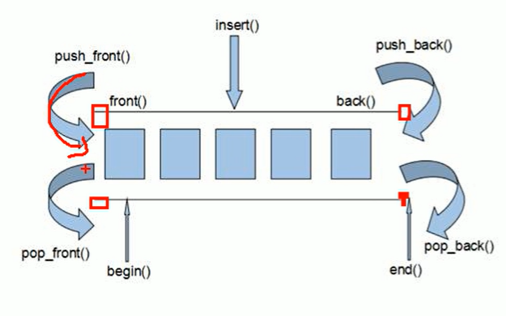
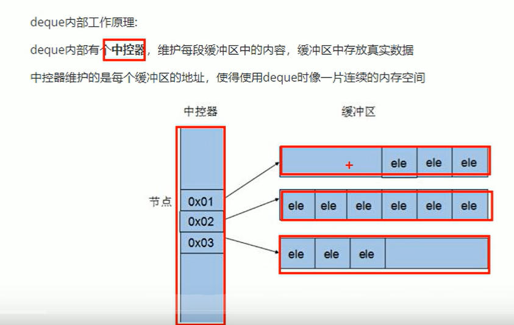

# deque容器

### deque(戴可) ：双端队列

#### deque和vector的区别

vector对于头部的插入和删除效率低，因为要将整体数据往后/前挪动，数据量越大，效率越低

**deque相对而言，头插的速度比vector快**

**vector访问元素的速度比deque快**，这和两者内部实现有关





deque迭代器也是支持随机访问的

### 构造函数

deque\<int>						普通构造

deque(n, elem)				  n个元素构造

deque(begin, end)			区间构造

deque(const deque &) 	拷贝构造

```c++
void func(deque<int>&d){
    for(deque<int>::iterator it = d.begin(); it != d.end(); it++){
        cout << *it << " ";
    }
}


void func2(const deque<int>&d){
    for(deque<int>::const_iterator it = d.begin(); it != d.end(); it++){
        cout << *it << " ";
    }
}
```

==**如果要限定只读状态，则传参时要用const，迭代器要用const_iterator**==

### 赋值

重载=  

assign(begin, end) 

assign(n, elem)

assign(deque &d)  拷贝赋值

### 大小操作

deque.empty()

deque.size()

deque.resize(num)

deque.resize(num, elem)

**无capacity**

### 插入和删除

头插	push_front

头删	pop_front

尾插同理

指定位置操作：

insert(pos, elm)		在pos位置插入一个elem元素的拷贝，**返回新数据位置**

insert(pos, n, elem)

insert(pos, begin, end)

clear()

erase(begin, end)  	删除区间数据，**返回下一个数据位置**

erase(pos)				  删除指定数据，**返回下一个数据位置**

### 数据存取

at()

[]

front()	返回第一个数据元素

back()	返回最后一个数据元素

### 排序

**sort(begin, end)**

**需先引入头文件\<algorithm>**

**sort(d.begin(), d.end());**

**vector也可以用sort排序**